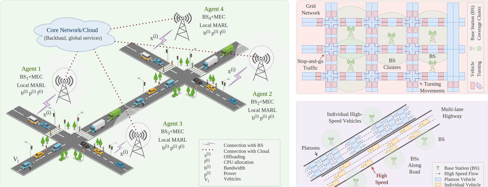
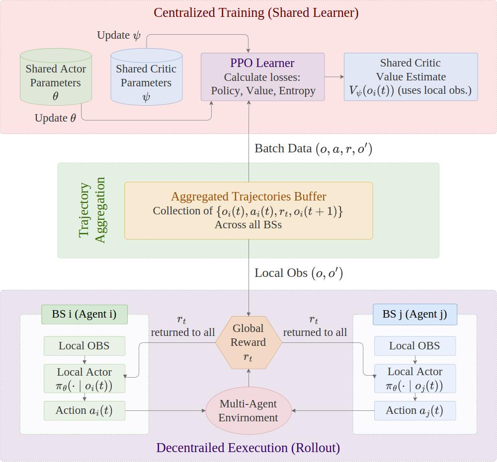
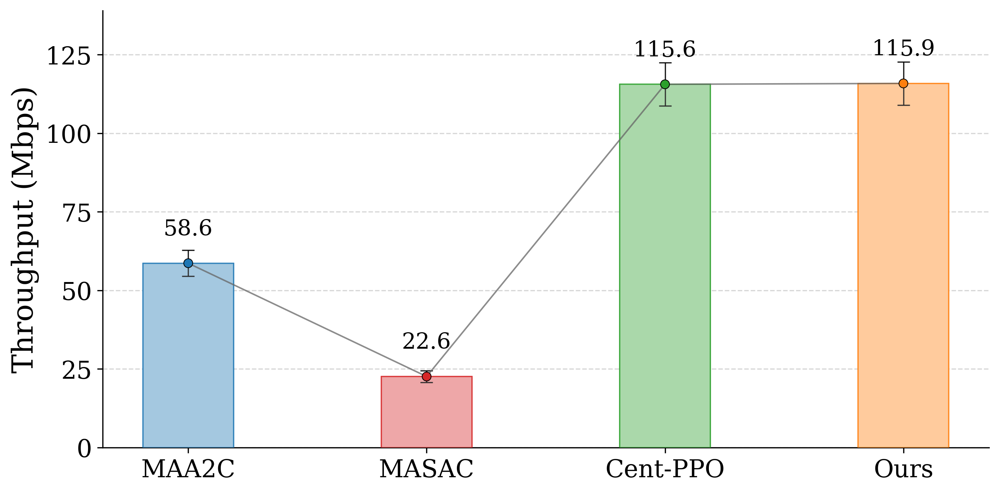
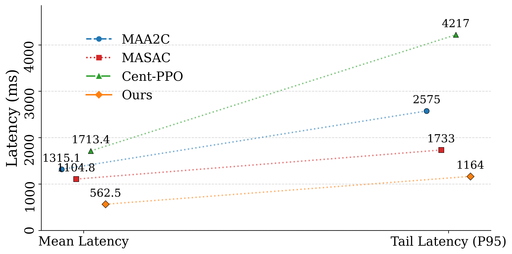
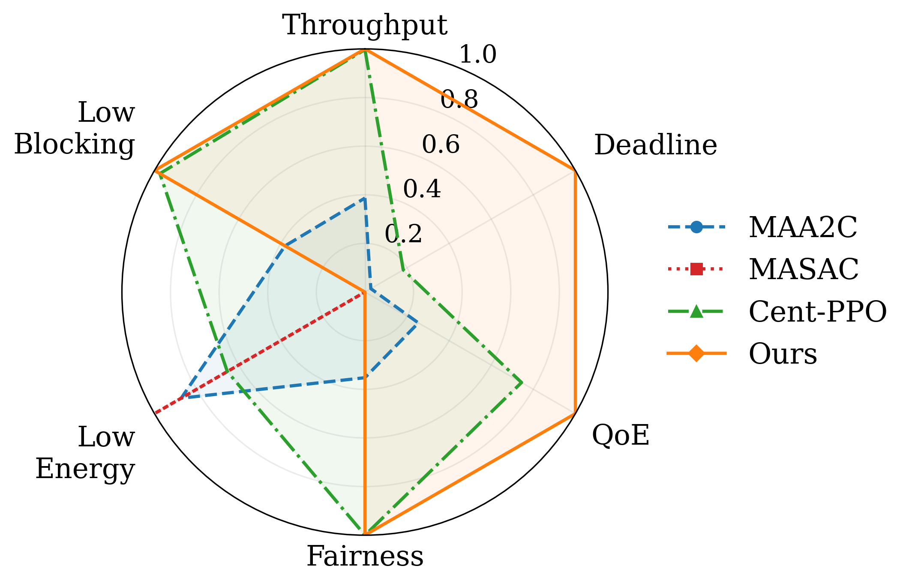
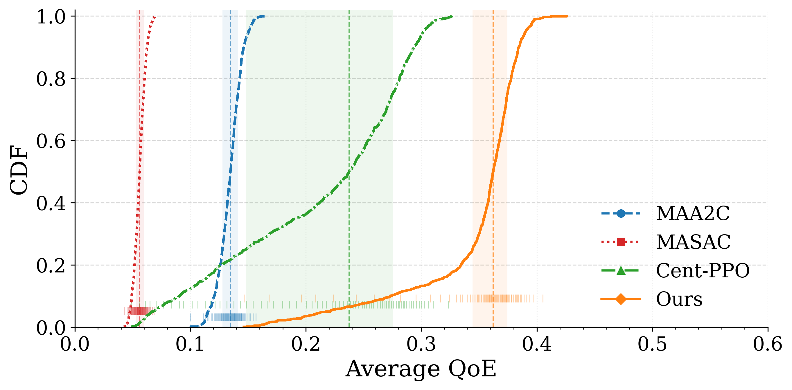
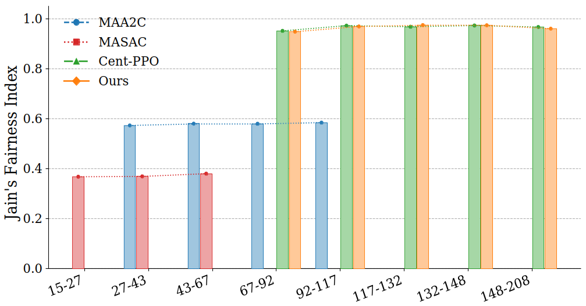

<h1 align="center">Joint Radio-Compute Resource Management for Clustered Vehicular Edge Networks</h1>

<p align="center"><b>Coop-MAPPO-IoV</b></p>

<p align="center">
  
  
  
  
  
  
</p>

> **Arif Raza, Uddin Md. Borhan, Anam Nasir, Jie Chen, and Lu Wang**  
> College of Computer Science and Software Engineering, Shenzhen University  
> Harbin Institute of Technology  
> Corresponding author: wanglu@szu.edu.cn

---

## Overview

<p align="justify">
This repository contains the implementation and evaluation assets for <b>joint radio-compute resource management in clustered vehicular edge networks</b>. The framework studies how clustered multi-cell base stations (BSs), each paired with a mobile edge computing (MEC) server, can cooperatively control <b>transmit power</b>, <b>resource-block activation</b>, <b>task offloading</b>, and <b>CPU allocation</b> under dynamic mobility, interference coupling, queue evolution, and heterogeneous intelligent transportation system (ITS) traffic.
</p>

<p align="justify">
The core learning design is a <b>cooperative multi-agent proximal policy optimization</b> framework under <b>centralized learning and decentralized execution (CLDE)</b>. Each BS acts locally from a compact neighbor-aware observation, while a shared learner updates common actor-critic parameters using a shared quality-of-experience (QoE) oriented global reward. The repository also includes comparison results against <b>MAA2C</b>, <b>MA-SAC</b>, <b>centralized PPO</b>, a <b>heuristic controller</b>, and a <b>radio-only</b> reference, together with ready-made figures and CSV logs for reproducible analysis.
</p>

The framework addresses four tightly coupled challenges in clustered IoV-VEC control:

1. <b>Unified radio-compute orchestration:</b> communication and computation are optimized jointly rather than as loosely coupled subproblems.
2. <b>Cooperative BS-level learning:</b> each BS acts from local observations, but policies are coordinated through centralized training and a shared reward.
3. <b>Scalable state and reward design:</b> compact neighbor-aware features and a normalized multi-objective QoE reward keep learning stable in dense deployments.
4. <b>ITS-oriented evaluation:</b> the framework is validated under SUMO-driven urban, highway, and mixed mobility with heterogeneous traffic classes, deadline constraints, and scalability studies.

---

## Clustered IoV-VEC System Model

<p align="center">
  
</p>

<p align="justify">
The system model couples clustered BSs, MEC queues, dynamic vehicle association, reuse-based interference, and delay-aware offloading into one closed-loop control problem. Each BS-MEC pair acts as an agent that serves vehicles within its coverage region while accounting for neighboring load, radio activity, and shared-spectrum interference.
</p>

---

## CLDE Learning Workflow

<p align="center">
  
</p>

<p align="justify">
During rollout, each BS observes only its own compact local state and samples a continuous action from the shared policy. The simulator then updates association, RB activation, interference, offloading workload, MEC service, and end-to-end delay, and returns a <b>shared global reward</b>. During training, trajectories from all BSs are aggregated and used by a shared PPO learner to update common actor and critic parameters. Runtime execution remains fully decentralized at the BS side.
</p>

---

## Architecture

```text
SUMO mobility traces (urban / highway / mixed)
        |
        v
Clustered IoV-VEC environment
  Vehicles, BS coverage, MEC queues, traffic classes
  Reuse-based interference, RB activation, offloading, CPU service
        |
        v
Local BS observation o_i(t)   [20 normalized features]
  - local radio utilization
  - local MEC queue status
  - served / blocked ratios
  - demand summaries
  - mobility churn cues
  - neighbor activity summaries
        |
        v
Shared cooperative actor  pi_theta(a_i | o_i)
  Continuous 4-D action per BS:
    [power fraction, RB activation fraction,
     offloading fraction, CPU utilization fraction]
        |
        v
Environment transition
  Association update
  Water-filling style power shaping
  Rate / delay / queue evolution
  QoE and deadline computation
        |
        v
Shared global reward r_t
  throughput + delay + deadline + QoE
  - energy - blocking - unfairness
        |
        v
Shared PPO learner under CLDE
  Aggregated multi-BS trajectories
  Policy loss + value loss + entropy regularization
```

---

## Method Details

This section summarizes how the main components of the framework are organized conceptually in the repository and in the accompanying paper.

### 1. Cooperative MDP and BS Action Space

The clustered vehicular edge network is modeled as a cooperative MDP in which each BS is an agent. At each control epoch, BS \(i\) selects a continuous action

```text
a_i(t) = [alpha_i(t), kappa_i(t), xi_i(t), phi_i(t)] in [0,1]^4
```

with the following meanings:

```text
alpha_i(t)  -> transmit-power fraction
kappa_i(t)  -> RB activation fraction
xi_i(t)     -> offloading ratio
phi_i(t)    -> MEC CPU utilization fraction
```

These normalized controls are mapped to physical resources as:

```text
P_i(t) = alpha_i(t) * P_i^max
K_i(t) = round(kappa_i(t) * K_i^max)
F_i(t) = phi_i(t) * F_i^max
```

This low-dimensional BS-level interface preserves tractability while still exposing the main control knobs needed for clustered radio-compute orchestration.

---

### 2. Joint Radio-Compute and QoE Modeling

The environment couples radio service, MEC queue evolution, and user QoE in a single control loop.

**Radio layer.** Each BS activates a subset of RBs and distributes power over active RBs under a total power budget. Inter-cell interference is modeled through reuse-based coupling across neighboring BSs. Achievable rate is derived from an SINR-based link model with protocol overhead and capped spectral efficiency.

**Association.** Vehicles are dynamically associated to the BS that best balances link quality and current load. If a user cannot be served after association, it contributes to the blocking term.

**Compute layer.** The BS action determines the fraction of demand that is offloaded to the MEC server. Offloaded tasks are translated into workload arrivals, which update the MEC backlog according to

```text
q_i(t+1) = max{ q_i(t) - F_i(t) * Delta, 0 } + lambda_i(t)
```

**End-to-end delay.** Total delay is the sum of radio-side delay and MEC delay:

```text
T_u(t) = T_u^r(t) + T_u^m(t)
```

**User QoE.** QoE jointly reflects throughput fulfillment and delay satisfaction, instead of optimizing one metric in isolation.

This joint formulation is the main reason the method can reduce queue buildup and tail-latency escalation while preserving throughput.

---

### 3. Cooperative MA-PPO Under CLDE

A single stochastic actor and a shared critic are used across all BSs. During execution, each BS performs a local forward pass only:

```text
a_i(t) ~ pi_theta(. | o_i(t))
```

During training, trajectories from all BSs are aggregated into a shared rollout buffer and optimized with PPO using:

```text
- clipped policy objective
- value regression loss
- entropy regularization
```

The design preserves two desirable properties simultaneously:

1. <b>Cooperation</b>, because all BSs learn from a shared reward and shared parameters.
2. <b>Scalability</b>, because runtime execution does not require centralized online decision making.

This is the central learning mechanism behind the proposed Coop-MAPPO-IoV framework.

---

### 4. Scalable Observation and Reward Design

Each BS receives a compact 20-dimensional observation that summarizes the most relevant local and neighborhood signals without exploding with the number of vehicles. The observation includes normalized descriptors of:

```text
- power, RB, and CPU utilization
- MEC backlog level
- demand and served-load summaries
- blocking and churn indicators
- neighboring RB use and transmit activity
- mandatory-offload summary
```

The shared reward is a normalized multi-objective QoE score of the form:

```text
reward = + throughput
         + delay satisfaction
         + deadline satisfaction
         + average QoE
         - energy cost
         - blocking
         - unfairness
```

The reward is clipped to a bounded interval so that on-policy PPO updates remain numerically stable even when traffic conditions become bursty or heavily congested.

---

### 5. ITS-Oriented Evaluation Protocol

The evaluation protocol is designed to reflect deployment-oriented ITS conditions rather than small synthetic toy settings.

**Mobility regimes**

```text
omega_u : urban grid with stop-and-go traffic and turning events
omega_h : highway traffic with high-speed flow and transient coverage changes
omega_m : mixed regime combining both conditions
```

**Traffic classes**

```text
- safety-oriented traffic with stricter delay sensitivity
- infotainment traffic with more throughput-oriented demand
- heavy and light tasks under shared radio-compute resources
```

**Logged performance metrics**

```text
- throughput
- average latency
- P95 latency
- deadline satisfaction
- QoE
- energy efficiency
- Jain's fairness index
- blocking probability
```

This evaluation logic enables direct comparison between the proposed method and the learning and non-learning baselines under common settings.

---

## Repository Layout

```text
Coop-MAPPO-IoV-main/
├── CITATION.cff
├── Figs
│   ├── architecture.png            <- clustered IoV-VEC framework overview
│   └── clde.jpg                    <- centralized learning / decentralized execution workflow
├── graphs
│   ├── fairness_vs_load.png        <- Jain's fairness across offered-load bins
│   ├── latency_mean_tail_single_scale.png
│   │                                <- mean latency and P95 latency comparison
│   ├── qoe_cdf.png                 <- per-user QoE cumulative distribution
│   ├── radar_summary.png           <- normalized multi-metric comparison
│   └── throughput_bar.png          <- steady-state throughput comparison
├── LICENSE
├── pyproject.toml
├── README.md
├── requirements.txt
├── results
│   ├── a2c_episode_metrics.csv     <- MAA2C episode-level metrics
│   ├── heuristic_episode_metrics.csv
│   ├── ppo_central_episode_metrics.csv
│   ├── ppo_episode_metrics.csv     <- proposed cooperative PPO metrics
│   ├── ppo_with_4_BS.csv           <- scalability study with 4 BSs
│   ├── ppo_with_6_BS.csv           <- scalability study with 6 BSs
│   ├── ppo_with_8_BS.csv           <- scalability study with 8 BSs
│   ├── radio_only.csv              <- radio-only reference variant
│   └── sac_episode_metrics.csv     <- MA-SAC episode-level metrics
└── scripts
    ├── a2c_multi.ipynb             <- MAA2C baseline notebook
    ├── heuristic.ipynb             <- heuristic resource-control notebook
    ├── ppo_cent.ipynb              <- centralized PPO baseline notebook
    ├── ppo_multi.ipynb             <- proposed cooperative MA-PPO notebook
    ├── ppo_var_bs.ipynb            <- scalability study with varying BS counts
    ├── radio_only.ipynb            <- radio-only ablation notebook
    └── sac_multi.ipynb             <- MA-SAC baseline notebook
```

---

## Code Tour

This repository is notebook-centered. The main logic is organized so that the proposed method, baselines, and scalability experiments can be reproduced from self-contained notebooks, while the `results/` and `graphs/` folders store the outputs used for analysis and paper-ready visualization.

### 1. `scripts/ppo_multi.ipynb` — main Coop-MAPPO-IoV pipeline

This is the core implementation notebook of the repository. It contains the full cooperative MA-PPO workflow for clustered IoV-VEC control, including environment design, PPO configuration, logging, training, and checkpointing.

The notebook is organized conceptually as follows:

```text
Imports and library setup
  -> NumPy, Matplotlib, Gymnasium
  -> Ray / RLlib / Torch

Basic PHY and helper functions
  -> RX sensitivity
  -> spectral efficiency from SINR
  -> simple MIMO rank and SE calculation

Environment building blocks
  -> Channel
  -> BaseStation
  -> User

Main multi-agent environment
  -> MultiAgentMobileNetwork(MultiAgentEnv)
  -> mobility, association, RB assignment, interference, queues, reward
  -> local observations and global state construction

RLlib callback utilities
  -> EpisodeCSVLogger
  -> episode-wise metric accumulation and CSV export

Environment factory
  -> rllib_env_creator()

Training configuration and main loop
  -> PPOConfig
  -> shared-policy multi-agent setup
  -> rollout / batch settings
  -> checkpoint saving
  -> console logging and step counting
```

<p align="justify">
In practical terms, `ppo_multi.ipynb` is the notebook to open first if you want to understand how the full system works end to end. It moves from physical-layer abstractions, to BS-user environment dynamics, to cooperative PPO training under CLDE in one place.
</p>

### 2. PHY helpers and link abstractions

At the beginning of the main notebook, helper functions define the lightweight radio model used by the environment. These include sensitivity estimation, Shannon-like spectral efficiency with an SNR gap, capped modulation efficiency, and a simplified MIMO gain abstraction.

These helpers are important because they provide the bridge between continuous BS actions and measurable communication outcomes:

```text
transmit power fraction
        -> per-channel power
        -> SINR
        -> spectral efficiency
        -> served throughput
```

This keeps the learning interface compact while preserving the radio-compute coupling required by the paper.

### 3. Environment entities: `Channel`, `BaseStation`, and `User`

The notebook defines small building-block classes that represent the main objects manipulated by the simulator:

- `Channel` for channel-level radio resources.
- `BaseStation` for BS-side state and control.
- `User` for vehicle-side demand, position, and service attributes.

These abstractions keep the simulator readable by separating the physical objects from the higher-level control loop.

### 4. `MultiAgentMobileNetwork` — the main simulator

The main environment class implements the clustered IoV-VEC world as an RLlib-compatible multi-agent environment. This is where most of the actual system behavior lives.

Key responsibilities include:

```text
- default BS placement
- channel subset assignment
- grid-road construction
- Manhattan mobility initialization and movement
- coverage and best-BS selection
- on-demand channel activation
- interference estimation
- water-filling style power shaping
- allocation and queue update
- per-step reward and KPI computation
- observation generation
- rendering utilities
```

<p align="justify">
In other words, this class turns the paper's cooperative MDP into an executable simulator. It is the most important part of the repository for readers who want to understand how mobility, interference, MEC queues, and BS-level control are connected in code.
</p>

### 5. Observation interface

The observation is implemented as a compact normalized vector at the BS level. The notebook uses a fixed observation index layout so the policy sees a stable feature ordering across all BSs and all episodes.

The observation groups include:

```text
- BS type and transmit status
- channel and coverage utilization
- local load and traffic demand summaries
- nearby demand pressure
- average speed and radial velocity
- interference summary
- MEC queue and CPU utilization
- offloading ratio
- served ratio and blocking fraction
- channel-match quality
- mandatory-offload summary
- neighbor transmit activity
```

This design is consistent with the paper's goal of preserving scalability under dense deployments.

### 6. `EpisodeCSVLogger` — metric tracing and reproducibility

The callback class records scalar `info` fields during rollout and writes per-episode summaries to CSV. This is how the repository produces the experiment logs that later appear in `results/`.

Its role is especially important for reproducibility:

```text
environment info fields
        -> episode.user_data accumulation
        -> per-episode mean metrics
        -> ppo_episode_metrics.csv
```

The callback also exposes custom metrics back to RLlib so training summaries remain visible during optimization.

### 7. `rllib_env_creator()` — RLlib environment registration

This small wrapper makes the multi-agent environment available to RLlib. It is the connection point between the simulator class and the PPO training stack.

Conceptually:

```text
MultiAgentMobileNetwork
        -> env creator
        -> RLlib registration
        -> training config
```

### 8. PPO configuration and shared-policy CLDE training

The bottom part of `ppo_multi.ipynb` builds the PPO learner with RLlib. This section defines the actual learning behavior of the proposed method.

The configuration includes:

```text
- Torch backend
- complete-episode batch collection
- GAE and PPO clipping
- shared multi-agent policy mapping
- one shared policy for all BS agents
- train batch size and SGD minibatches
- normalization of continuous actions
- callback attachment for CSV logging
```

The training loop then performs:

```text
train()
  -> update total environment steps
  -> print mean return and episode length
  -> save checkpoints every fixed interval
```

This mirrors the CLDE logic described in the paper: local runtime action selection with centralized parameter updates from aggregated trajectories.

### 9. Baseline notebooks

The remaining notebooks under `scripts/` provide controlled comparisons against alternative decision strategies.

```text
a2c_multi.ipynb    -> cooperative / multi-agent A2C baseline
sac_multi.ipynb    -> multi-agent SAC baseline
ppo_cent.ipynb     -> centralized PPO baseline
heuristic.ipynb    -> non-learning rule-based controller
radio_only.ipynb   -> radio-only reference variant
```

These notebooks are useful when you want to compare algorithmic behavior under the same environment assumptions.

### 10. `scripts/ppo_var_bs.ipynb` — scalability analysis

This notebook isolates the effect of infrastructure density by changing the number of BSs while keeping the user population fixed. It is the notebook behind the scalability table and related discussion in the paper.

The expected analysis path is:

```text
vary BS count
    -> rerun cooperative PPO
    -> export episode metrics
    -> compare throughput, latency, and QoE trends
```

### 11. `results/` — raw experiment outputs

The CSV files under `results/` are the main analysis artifacts of the repository. They contain episode-level metrics for the proposed method, learning baselines, ablations, and scalability runs.

Typical usage:

```text
results/*.csv
    -> load in pandas
    -> compute steady-state means over the tail of training
    -> compare baselines
    -> produce paper figures
```

### 12. `graphs/` and `Figs/` — figures for explanation and reporting

The repository separates conceptual diagrams from quantitative figures:

- `Figs/` stores the architecture and CLDE workflow illustrations.
- `graphs/` stores the generated result figures such as throughput, latency, fairness, QoE CDF, and radar summaries.

This split is useful because it separates <b>how the system works</b> from <b>how the system performs</b>.

### 13. Suggested reading order for new readers

If you are opening the repository for the first time, the most efficient path is:

```text
1. Read README.md
2. View Figs/architecture.png and Figs/clde.jpg
3. Open scripts/ppo_multi.ipynb
4. Inspect MultiAgentMobileNetwork and EpisodeCSVLogger
5. Run scripts/ppo_multi.ipynb
6. Compare with scripts/ppo_cent.ipynb, a2c_multi.ipynb, and sac_multi.ipynb
7. Use results/*.csv and graphs/*.png for analysis
```

This reading order moves from concept, to implementation, to comparison, to final visualization.

---

## Requirements

The repository includes both `requirements.txt` and `pyproject.toml` for environment setup.

Typical dependencies include:

- Python 3.x
- Jupyter / IPython for notebook execution
- PyTorch
- RLlib with Torch backend
- NumPy / Pandas
- Matplotlib
- SUMO-related preprocessing or trace-generation dependencies, depending on the workflow

A standard setup is:

```bash
git clone https://github.com/arifrazakh/coop-mappo-iov.git
cd coop-mappo-iov

python -m venv .venv
source .venv/bin/activate   # On Windows: .venv\Scripts\activate

pip install -r requirements.txt
```

If you prefer editable installation through the project metadata:

```bash
pip install -e .
```

---

## Quick Start

### 1. Launch Jupyter

```bash
jupyter lab
```

or

```bash
jupyter notebook
```

### 2. Run the proposed cooperative PPO notebook

Open:

```text
scripts/ppo_multi.ipynb
```

This notebook contains the main cooperative MA-PPO training and evaluation pipeline for the clustered IoV-VEC setting.

### 3. Run comparison baselines

For baseline experiments, use the following notebooks:

```text
scripts/ppo_cent.ipynb    -> centralized PPO
scripts/a2c_multi.ipynb   -> multi-agent A2C
scripts/sac_multi.ipynb   -> multi-agent SAC
scripts/heuristic.ipynb   -> heuristic controller
scripts/radio_only.ipynb  -> radio-only reference
```

### 4. Run the scalability study

Open:

```text
scripts/ppo_var_bs.ipynb
```

This notebook evaluates how the proposed method behaves as the number of BSs increases while vehicle density is held fixed.

### 5. Inspect generated outputs

Key experiment outputs are stored in:

```text
results/   -> episode-level CSV metrics
graphs/    -> ready-made publication figures
Figs/      -> architecture and CLDE illustrations
```

---

## Key Notebooks

| Notebook | Purpose |
|---|---|
| `scripts/ppo_multi.ipynb` | Proposed cooperative MA-PPO / Coop-MAPPO-IoV training and evaluation |
| `scripts/ppo_cent.ipynb` | Centralized PPO baseline |
| `scripts/a2c_multi.ipynb` | Multi-agent A2C baseline |
| `scripts/sac_multi.ipynb` | Multi-agent SAC baseline |
| `scripts/heuristic.ipynb` | Heuristic controller for reference comparison |
| `scripts/radio_only.ipynb` | Radio-only variant for component analysis |
| `scripts/ppo_var_bs.ipynb` | Scalability analysis under different BS counts |

---

## Graphs and Visual Results

<p align="center">
  
  &nbsp;
  
</p>

<p align="justify">
<b>Left: Steady-state throughput comparison.</b> The proposed cooperative MA-PPO method reaches the high-throughput operating region while preserving better end-to-end service quality than the weaker baselines.
</p>

<p align="justify">
<b>Right: Mean latency and P95 latency.</b> The proposed method achieves the lowest mean delay and the lowest tail delay among the learning baselines, showing the value of joint radio-compute control under queue dynamics and interference coupling.
</p>

<p align="center">
  
  &nbsp;
  
</p>

<p align="justify">
<b>Left: Normalized radar summary.</b> The figure compares throughput, deadline satisfaction, QoE, fairness, low-energy behavior, and low-blocking performance in one view. The proposed method dominates most axes simultaneously, confirming that the reward does not collapse to a single objective.
</p>

<p align="justify">
<b>Right: QoE CDF.</b> The per-user QoE distribution of the proposed method is shifted furthest to the right, indicating more users receive higher average service quality.
</p>

<p align="center">
  
</p>

<p align="justify">
<b>Fairness across offered-load bins.</b> The proposed policy remains in the top fairness band over higher load regimes, indicating that the compact observation and multi-objective reward maintain balanced service allocation even when congestion increases.
</p>

---

## Key Results

Steady-state comparison of the learning baselines:

| Algorithm | Throughput (Mbps) | Mean Latency (ms) | P95 Latency (ms) | Ep. Return | Global Reward | QoE | Block (%) | Fairness |
|---|---:|---:|---:|---:|---:|---:|---:|---:|
| **Ours** | **115.9** | **562.5** | **1164.0** | **26.16** | **0.131** | **0.378** | **0.51** | 0.971 |
| Cent-PPO | 115.6 | 1733.0 | 4217.0 | 17.20 | 0.086 | 0.331 | 3.09 | **0.972** |
| MAA2C | 58.6 | 1315.1 | 2575.0 | -31.34 | -0.157 | 0.120 | 56.76 | 0.515 |
| MA-SAC | 22.6 | 1104.8 | 1713.4 | -50.80 | -0.254 | 0.049 | 81.80 | 0.348 |

Class-aware QoE and deadline comparison:

| Algorithm | Safety Deadline | Safety QoE | Infotainment Deadline | Infotainment QoE |
|---|---:|---:|---:|---:|
| **Ours** | **11.24** | **0.529** | **11.33** | **0.313** |
| Cent-PPO | 5.22 | 0.482 | 5.25 | 0.267 |
| MAA2C | 1.05 | 0.184 | 1.05 | 0.093 |
| MA-SAC | 0.60 | 0.074 | 0.58 | 0.039 |

Scalability of the proposed method with increasing BS density:

| BSs | Throughput (Mbps) | Avg. Latency (ms) | P95 Latency (ms) | QoE |
|---|---:|---:|---:|---:|
| 4 | 117.09 ± 6.86 | 567.44 ± 8.13 | 1193.92 ± 45.39 | 0.377 ± 0.014 |
| 6 | 140.88 ± 9.30 | 441.17 ± 15.42 | 1002.10 ± 12.64 | 0.457 ± 0.019 |
| 8 | **177.59 ± 8.20** | **318.12 ± 10.84** | **764.85 ± 69.54** | **0.576 ± 0.016** |

These results show that the cooperative BS-level PPO design improves throughput, latency, QoE, and deadline behavior jointly, while remaining stable as infrastructure density increases.

---

## Why the Proposed Method Works

The empirical profile of the repository can be understood through three design decisions:

1. <b>Joint radio-compute control</b> prevents the policy from optimizing bandwidth or offloading in isolation.
2. <b>Shared-policy CLDE learning</b> enables cooperation across BSs without requiring centralized runtime inference.
3. <b>Compact neighbor-aware state plus normalized reward</b> preserves scalability and fairness under dense traffic and bursty demand.

Together, these choices reduce blocking and tail-latency escalation while preserving a strong throughput operating point.

---

## Reproducibility Notes

- All major comparisons are backed by CSV logs under `results/`.
- The repository already includes the final publication-style graphs under `graphs/`.
- `CITATION.cff` is included for repository citation support.
- The notebook structure separates the proposed method, baseline methods, ablations, and scalability experiments for easier reproduction.


---

## License

This project is released under the terms specified in `LICENSE`.

---

## Repository Link

Project page: `https://github.com/arifrazakh/coop-mappo-iov/`
