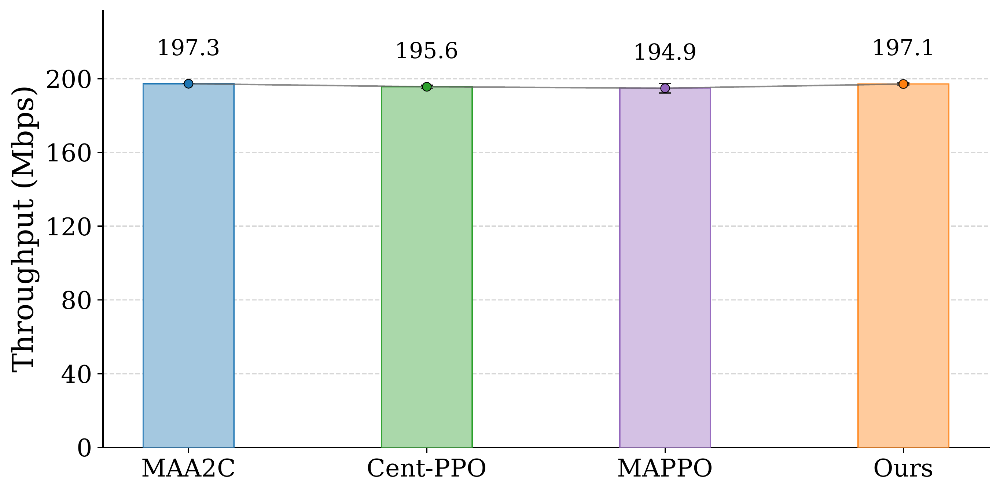
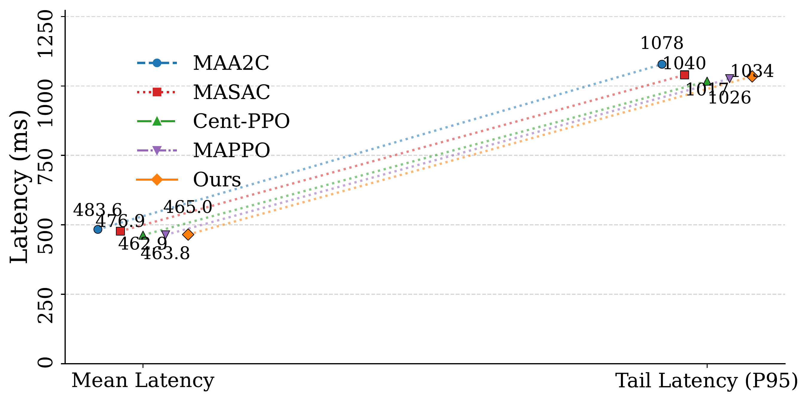
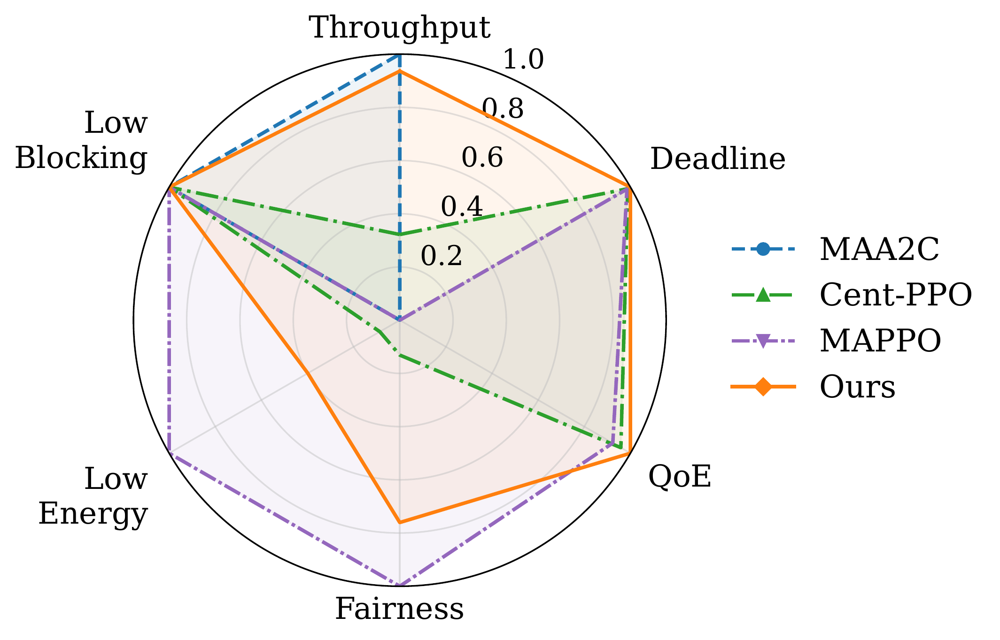
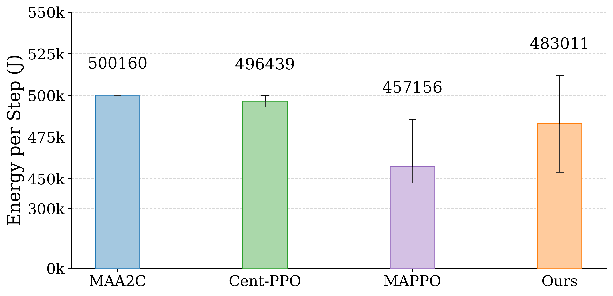
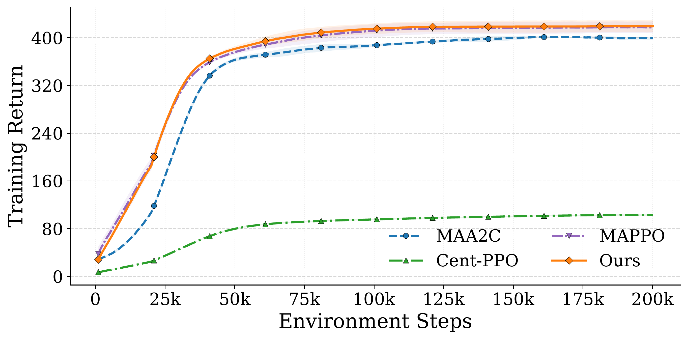

<h1 align="center">Joint Radio-Compute Resource Management for Clustered Vehicular Edge Networks</h1>

<p align="center"><b>Coop-MAPPO-IoV</b></p>

<p align="center">
  
  
  
  
  
  
</p>

> **Arif Raza, Uddin Md. Borhan, Anam Nasir, Jianqiang Li, Jie Chen, and Lu Wang**  
> Shenzhen University, Shenzhen, China  
> Harbin Institute of Technology, Harbin, China  
> Corresponding authors: **Lu Wang** and **Jie Chen**

---

## Overview

<p align="justify">
This repository contains the simulator, learning code, processed experiment tables, and plotting assets for <b>joint high-level radio-compute resource management in clustered vehicular edge networks</b>. Each base station (BS) is paired with a mobile edge computing (MEC) server and controls four continuous resource knobs: <b>transmit-power budget</b>, <b>active resource-block budget</b>, <b>task offloading ratio</b>, and <b>MEC CPU utilization</b>. Lower-level association, RB assignment, and per-RB power shaping are resolved inside the environment so the learned action remains compact.
</p>

<p align="justify">
The proposed controller is a <b>parameter-shared cooperative Proximal Policy Optimization (PPO)</b> design. BS trajectories are pooled during learning, but both the actor and value function use local BS observations. The repository also contains matched <b>MAPPO</b>, <b>Cent-PPO</b>, and <b>MA-A2C</b> references, a neighbor-information ablation, three mobility regimes, multi-user-load experiments, and 4-BS/8-BS scalability results. The checked-in CSVs correspond to the completed three-seed validation campaign used for the manuscript.
</p>

The framework addresses four tightly coupled challenges in clustered IoV-VEC control:

1. <b>Unified high-level radio-compute orchestration:</b> learned power, active-RB, offloading, and CPU decisions interact with radio interference, queue service, and task deadlines.
2. <b>Cooperative BS-level learning:</b> BSs act from local observations while shared parameters, pooled trajectories, and a common cluster reward provide coordination during training.
3. <b>Scalable state and reward design:</b> the actor receives a fixed 20-feature summary rather than a per-user state whose dimension grows with network load.
4. <b>Mobility-aware validation:</b> urban, highway, and mixed motion are evaluated alongside vehicle-load and BS-count changes under one reward specification.

---

## Clustered IoV-VEC System Model

<p align="center">
  
</p>

<p align="justify">
The environment links BS-MEC clusters, mobile users, reuse-sensitive radio service, MEC queues, and deadline-aware task processing. Each BS-MEC agent chooses only high-level budgets. User association, one-RB-per-user assignment in the default setting, and deterministic per-RB power refinement are environment operations. The cloud/backhaul element in the architecture is conceptual; finite backhaul delay or capacity is not part of the reported simulator model.
</p>

---

## CTDE Learning Workflow

<p align="center">
  
</p>

<p align="justify">
At each control epoch, every BS receives its own 20-dimensional observation and produces a four-dimensional action. The simulator then updates association, RB usage, reuse interference, task partitioning, MEC service, end-to-end delay, QoE, and the common cluster reward. Training aggregates trajectories from all BSs into one shared learner. This is centralized only in the data-aggregation/update sense: the proposed value function still consumes the local observation. MAPPO is implemented separately with a joint-observation critic. Online execution remains decentralized.
</p>

---

## Architecture

```text
Built-in mobility simulator (urban / highway / mixed)
        |
        v
Clustered IoV-VEC environment
  Vehicles, BS coverage, MEC queues, service/task classes
  Reuse interference, RB assignment, offloading, CPU service
        |
        v
Local BS observation o_i(t)   [20 normalized features]
  - local radio utilization and load summaries
  - local MEC backlog, CPU, and offloading state
  - demand, served/blocked, and mobility summaries
  - measured interference summary
  - compact aggregated neighbor activity
  - mandatory-offload fraction
        |
        v
Shared cooperative actor  pi_theta(a_i | o_i)
  Continuous 4-D action per BS:
    [power fraction, active-RB fraction,
     offloading fraction, CPU utilization fraction]
        |
        v
Environment transition
  Association and default one-RB-per-user assignment
  Single-pass per-RB power shaping and interference update
  Radio rate, MEC queue/service, latency, QoE, energy, fairness
        |
        v
Common cluster reward r_t
  + throughput, delay satisfaction, deadline satisfaction, QoE
  - infrastructure energy, blocking, unfairness
        |
        v
Central trajectory aggregation and shared PPO updates
  Local-observation actor + local-observation value function
  PPO clipping + value loss + entropy regularization
```

---

## Method Details

This section summarizes the implemented framework using repository-oriented wording and the terminology used by the current manuscript.

### 1. Cooperative MDP and BS Action Space

The simulator represents the network as a cooperative control problem with one agent per BS. At epoch <i>t</i>, BS <i>i</i> selects:

```text
a_i(t) = [alpha_i(t), kappa_i(t), xi_i(t), phi_i(t)] in [0,1]^4
```

with the following meanings:

```text
alpha_i(t)  -> transmit-power budget fraction
kappa_i(t)  -> active-RB budget fraction
xi_i(t)     -> task offloading ratio
phi_i(t)    -> MEC CPU utilization fraction
```

The normalized action is converted to physical budgets as:

```text
P_i(t) = alpha_i(t) * P_i^max
K_i(t) = floor(kappa_i(t) * K_i^max + 0.5)
F_i(t) = phi_i(t) * F_i^max
```

The learner therefore operates at the BS orchestration level. It does not learn the complete PHY scheduler: association, RB-to-user assignment, and per-RB power shaping remain simulator-side rules conditioned on the selected budgets.

---

### 2. Joint Radio-Compute and QoE Modeling

The environment evaluates radio service and edge-compute service in the same control step.

**Radio layer.** Large-scale channel gain changes with vehicle position through a deterministic 3GPP-UMa-style LOS/NLOS path-loss abstraction. The implementation includes antenna gains, protocol overhead, an SNR gap, a spectral-efficiency cap, and a rank-selection abstraction up to four layers. Stochastic shadowing, fast fading, and an explicit Doppler process are not enabled in the reported runs. Per-RB transmit power is refined with a bounded BS-local water-filling-style step.

**Association and RB assignment.** Coverage and association are recomputed every epoch using an estimated link-rate/load score. The default configuration gives each served user one RB. A user without an available resource is counted as blocked.

**Compute layer.** Heavy jobs exceeding the UE local budget are forced to the MEC, while eligible light jobs may be split between local and edge execution. Newly admitted MEC work is available in the current control step, and unserved cycles are carried forward:

```text
q_i(t+1) = max{q_i(t) + lambda_i(t) - F_i(t) * Delta, 0}
```

The default MEC scheduler is work-conserving and deadline aware. Residual queued work is accounted for first; newly admitted jobs are ordered using their compute demand relative to remaining deadline budget, with deterministic tie-breaking. For a divisible light task, local and MEC branches execute in parallel, so compute completion is governed by the slower branch rather than by summing the two branch times.

**End-to-end delay and QoE.** Total latency combines the radio-side scheduling-delay proxy with the resulting compute-completion delay:

```text
T_u(t) = T_u^r(t) + T_u^c(t)
```

QoE combines rate fulfillment and deadline-relative delay quality. The model does not include packet retransmission/HARQ dynamics, handover interruption, migration of already queued work, finite backhaul delay/capacity, or UE-side energy in the reported infrastructure-energy metric.

---

### 3. Parameter-Shared Cooperative PPO

The proposed method uses one stochastic actor and one value function shared across BSs. Both consume a local observation:

```text
a_i(t) ~ pi_theta(. | o_i(t))
V_i(t)  = V_psi(o_i(t))
```

Training pools complete BS trajectories and applies PPO with:

```text
- clipped policy objective
- generalized advantage estimation
- value regression loss
- entropy regularization
- minibatch stochastic-gradient updates
```

The common reward and shared parameters couple the BS policies during learning, while execution remains local. The `mappo` reference keeps the actor local but supplies the critic with the concatenated BS observations. `cent_ppo` centralizes both observation and action. `ma_a2c` provides a synchronous actor-critic baseline under the same environment and evaluation protocol.

---

### 4. Scalable Observation and Reward Design

Each BS receives a fixed 20-dimensional vector, so actor input size does not grow with the number of vehicles. The implemented features summarize:

```text
- BS type and normalized transmit-power / channel-use state
- local load and nearby-user potential
- demand, speed, radial motion, and speed variation
- requested-power and measured-interference summaries
- one compact neighbor-activity feature
- MEC queue, CPU utilization, and offloading state
- served ratio, blocked fraction, and channel match
- mandatory-offload fraction
```

The explicit neighbor feature averages adjacent-BS transmit and RB-load activity. The no-neighbor ablation masks this feature while retaining the other local information and the common training setup.

The shared reward combines normalized network objectives using fixed coefficients:

```text
reward = 0.30 * throughput
       + 0.20 * delay satisfaction
       + 0.20 * deadline satisfaction
       + 0.30 * average QoE
       - 0.05 * infrastructure energy
       - 0.20 * blocking
       - 0.10 * unfairness
```

The final reward is clipped to `[-1, 1]`. These coefficients are held fixed across all reported configurations. The experiments therefore test reuse of one reward specification across conditions, not sensitivity to changing individual coefficients.

---

### 5. Mobility-Aware Evaluation Protocol

The runner includes three built-in mobility regimes:

```text
urban   : grid-constrained movement, turns, intersections, stop-and-go behavior
highway : higher-speed lane-oriented movement with transient coverage changes
mixed   : a combined population containing urban-like and highway-like motion
```

The environment also generates safety and infotainment sessions, light and heavy compute tasks, and stochastic demand refreshes. Reported logs include:

```text
- aggregate throughput and episode return
- mean and P95 user latency
- 100-ms deadline-satisfaction percentage
- average QoE
- BS-level Jain fairness and blocking
- BS + MEC infrastructure energy
- wall-clock environment-step time
- task-type and service-class deadline statistics
```

The repository contains completed three-seed results for urban, highway, and mixed mobility, user populations from 20 to 120 at four BSs, and proportional BS scaling from 4 BS/80 vehicles to 8 BS/160 vehicles. Each of these configurations is trained independently; they are not zero-shot transfer tests.

---

## Simulation Setup

The paper configuration combines one-second control epochs, a 200-step episode, large-scale mobility-dependent propagation, MEC queues, and heterogeneous task arrivals.

```text
Decision interval             : 1 s
Episode length                : 200 control epochs
Reference deployment          : 4 macro BSs, 80 vehicles, 2 km x 2 km
BS height                     : 30 m
Maximum RBs per carrier       : 50
RB bandwidth                  : 180 kHz
Maximum BS transmit power     : 40 W
Carrier set                   : {3.4, 3.5, 3.6, 3.7} GHz
Thermal-noise density         : -174 dBm/Hz
Receiver noise figure         : 7 dB
SNR-gap parameter             : 1.5 dB
Maximum spectral efficiency   : 7.5 bit/s/Hz
MIMO abstraction              : rank up to 4
MEC capacity per BS           : 50 x 10^9 cycles/s
Workload intensity            : 5 x 10^7 cycles/Mbit
CPU energy coefficient        : 10^-27
Latency target                : 100 ms
Service mix                   : 30% safety, 70% infotainment
Heavy-task probability        : 0.70
Demand refresh probability    : 0.05 per user per epoch
```

Heavy tasks use `0.5-2.5 x 10^9` cycles and `2-8 Mbit`; light tasks use `0.05-0.4 x 10^9` cycles and `0.2-1.5 Mbit`. The UE local-compute budget is `0.5 x 10^9` cycles per control step. For the reported learning study, each configuration uses training seeds `42`, `43`, and `44`, a 200,000-environment-step budget (`1,000` complete episodes), and 20 post-training evaluation episodes with seeds `900000-900019`.

The full validation matrix contains 39 trained configurations: four main algorithms, the neighbor ablation, two additional mobility regimes, five non-reference user-load points, and one additional BS-scale point, all repeated over three training seeds.

---

## Repository Layout

```text
Coop-MAPPO-IoV-main/
├── CITATION.cff
├── Figs
│   ├── architecture.png              <- clustered IoV-VEC framework
│   └── clde.jpg                      <- shared-PPO training/execution workflow
├── data
│   ├── 00_run_inventory.csv          <- processed run inventory
│   ├── 03_main_cross_seed_summary.csv
│   ├── 11_neighbor_ablation_summary.csv
│   ├── 13_mobility_summary.csv
│   ├── 15_user_load_summary.csv
│   ├── 17_bs_scalability_summary.csv
│   ├── 20_training_curve_cross_seed.csv
│   ├── table_main_comparison.csv
│   ├── table_neighbor_ablation.csv
│   ├── table_mobility_breakdown.csv
│   ├── table_user_load_scalability.csv
│   ├── table_bs_scalability.csv
│   ├── eval_*_sample.csv             <- representative raw-log samples
│   └── ...                           <- audits, manifests, schemas, task/service tables
├── graphs
│   ├── throughput.png                <- main throughput comparison
│   ├── latency.png                   <- mean/P95 latency comparison
│   ├── radar.png                     <- normalized multi-objective profile
│   ├── qoe_cdf.png                   <- per-user QoE distribution
│   ├── main_energy.png               <- modeled infrastructure energy
│   └── episode_return.png            <- stored RLlib training-return export
├── LICENSE
├── pyproject.toml
├── README.md
├── requirements.txt
└── scripts
    └── mappo.py                      <- complete paper experiment runner
```

---

## Code Tour

The repository is centered on one end-to-end runner. `scripts/mappo.py` contains the environment, PPO-family implementations, evaluation pipeline, and paper-table aggregation. The `data/` directory contains processed outputs from the completed validation campaign.

### 1. `scripts/mappo.py` - targeted PPO-family runner

`mappo.py` supports three suites:

```text
paper    -> full manuscript experiment matrix
targeted -> compact PPO-family + mobility + neighbor suite
single   -> one chosen method/scenario configuration
```

The full `paper` suite covers:

```text
ours / mappo / cent_ppo / ma_a2c on the 4-BS/80-user urban reference
ours / urban / neighbor summary masked
ours / highway and mixed mobility
ours / user loads 20, 40, 60, 80, 100, 120 with four BSs
ours / 4-BS and 8-BS proportional scaling
```

Raw run logs are written under `runs/`, while cross-run tables are written under `summaries/`.

### 2. PHY helpers and link abstractions

The radio helpers implement thermal-noise-based sensitivity, SINR-to-spectral-efficiency mapping with a 1.5 dB gap and 7.5 bit/s/Hz cap, the simplified rank-selection MIMO abstraction, deterministic UMa-style path loss, and per-RB power refinement.

The control path is:

```text
power and active-RB fractions
   -> BS power/RB budgets
   -> deterministic association and RB assignment
   -> BS-local per-RB power shaping
   -> reuse-coupled SINR and spectral efficiency
   -> served throughput
```

This division keeps the learning problem at the cross-layer resource-orchestration level rather than turning every user/RB scheduling choice into an RL action.

### 3. Environment entities: `Channel`, `BaseStation`, and `User`

The core simulator objects represent the radio and compute state:

- `Channel` stores carrier frequency, RB bandwidth, noise figure, occupancy, and BS association.
- `BaseStation` stores radio power, coverage, channel assignments, MEC backlog, offloading state, and CPU state.
- `User` stores mobility, service class, traffic demand, task type/size, offloading requirement, channel assignment, rate, and latency fields.

### 4. `MultiAgentMobileNetwork` - the main simulator

`MultiAgentMobileNetwork` is an RLlib-compatible `MultiAgentEnv`. It implements:

```text
- configurable BS count, user count, area, and carrier resources
- urban, highway, and mixed mobility
- per-epoch coverage, association, and default one-RB assignment
- inter-BS interference and deterministic power shaping
- heavy/light task generation and local/MEC partitioning
- work-conserving MEC queue dynamics and deadline-aware service
- 20-D local observations and optional neighbor masking
- one common multi-objective reward returned to every BS
- training/evaluation KPI logging
```

For MAPPO, the actor still sees the local 20-D vector while a custom critic receives the concatenated BS observation. Cent-PPO uses a flattened centralized observation and a joint action.

### 5. Logging and matched evaluation

Each trained run can produce:

```text
config.json
train_iterations.csv
train_episodes.csv
eval_steps.csv
eval_bs_steps.csv
eval_episodes.csv
eval_user_steps.csv
eval_user_metrics.csv
run_summary.csv
checkpoints/
```

Evaluation seeds start at `900000`. The reported tables use evaluation seeds `900000-900019` for every trained seed and summarize independent training seeds `42`, `43`, and `44` with the sample standard deviation.

### 6. PPO-family integration

The proposed method uses a shared RLlib PPO policy with local actor/value inputs. MAPPO uses `SplitActorCentralCriticModel`: for four BSs, its actor reads 20 local features while its critic receives the 80-dimensional concatenated BS observation. `CentralizedPPOEnv` exposes an 80-D observation and a 16-D joint action at the 4-BS reference point. MA-A2C uses native RLlib A2C when available and an A2C-compatible synchronous fallback otherwise.

The paper PPO configuration is:

```text
gamma = 0.99
GAE lambda = 0.95
learning rate = 5e-5
clip parameter = 0.2
train batch size = 1000
minibatch size = 250
SGD passes per update = 10
hidden layers = [256, 256], tanh
batch mode = complete episodes
```

The command-line default for `--train-env-steps` is intentionally shorter for convenience; paper reproduction should explicitly pass `--train-env-steps 200000`.

### 7. `mappo.py` paper matrix and aggregation helpers

The same script builds the experiment list and post-processes run summaries into manuscript-oriented CSVs. The `paper_specs()` helper expands the four main methods, neighbor masking, mobility, vehicle-load sweep, and proportional BS scaling. Aggregation routines then create the main comparison, task-type, service-class, neighbor-ablation, mobility, user-load, and BS-scalability tables without hard-coding the reported metric values.

---

## Requirements

The repository declares its runtime dependencies in both `requirements.txt` and `pyproject.toml`:

- Python 3.10 or newer
- NumPy 1.24 or newer
- Gymnasium 0.28 or newer
- Matplotlib 3.7 or newer
- Ray RLlib 2.8 or newer
- PyTorch 2.0 or newer

A standard setup is:

```bash
git clone https://github.com/arifrazakh/coop-mappo-iov.git
cd coop-mappo-iov

python -m venv .venv
source .venv/bin/activate   # Windows: .venv\Scripts\activate

python -m pip install --upgrade pip
python -m pip install -r requirements.txt
```

The project metadata also supports:

```bash
python -m pip install -e .
```

---

## Quick Start

### 1. Inspect runner options

```bash
python scripts/mappo.py --help
```

### 2. Run one proposed-method experiment

```bash
python scripts/mappo.py \
  --suite single \
  --method ours \
  --scenario urban \
  --seeds 42 \
  --train-env-steps 200000 \
  --eval-episodes 20 \
  --output-dir outputs/ours_seed42
```

The paper budget is 200,000 environment steps. Because complete episodes are used, this corresponds to 1,000 full 200-step episodes at the reference setting.

### 3. Run comparison baselines

Run one matched reference with the same budget:

```bash
python scripts/mappo.py --suite single --method mappo \
  --scenario urban --seeds 42 --train-env-steps 200000 \
  --eval-episodes 20 --output-dir outputs/mappo_seed42

python scripts/mappo.py --suite single --method cent_ppo \
  --scenario urban --seeds 42 --train-env-steps 200000 \
  --eval-episodes 20 --output-dir outputs/centppo_seed42

python scripts/mappo.py --suite single --method ma_a2c \
  --scenario urban --seeds 42 --train-env-steps 200000 \
  --eval-episodes 20 --output-dir outputs/maa2c_seed42
```

Repeat with seeds `43` and `44` for the complete three-seed comparison. To launch the full 39-configuration manuscript matrix from one command:

```bash
python scripts/mappo.py \
  --suite paper \
  --seeds 42 43 44 \
  --train-env-steps 200000 \
  --eval-episodes 20 \
  --output-dir paper_experiment_results
```

### 4. Run a BS-density case

The manuscript's proportional BS-scale comparison keeps 20 vehicles per BS. For example, an 8-BS/160-vehicle run is:

```bash
python scripts/mappo.py \
  --suite single --method ours --scenario urban \
  --num-bs 8 --num-users 160 --seeds 42 \
  --train-env-steps 200000 --eval-episodes 20 \
  --output-dir outputs/ours_bs8_u160_seed42
```

Repeat for seeds `43` and `44` to reproduce the three-seed 8-BS point. These scale points are independently trained policies, not a zero-shot transfer evaluation.

### 5. Inspect generated outputs

Each output root follows this structure:

```text
runs/<method>__<variant>__<scenario>__...__seed<seed>/
  -> config, training CSVs, checkpoint, raw evaluation CSVs, run summary

summaries/
  -> experiment manifest, merged run summaries, and paper-table CSVs
```

The checked-in `data/` directory already contains the processed manuscript tables, audit files, sample raw-log schemas, and training-curve exports. `graphs/` contains the plotted main comparison assets, and `Figs/` contains the system and learning diagrams.

---

## Key Scripts

| Script | Purpose |
|---|---|
| `scripts/mappo.py` | Proposed cooperative PPO, MAPPO, Cent-PPO, MA-A2C, neighbor ablation, mobility, user-load, BS-scaling, evaluation, and table aggregation |

---

## Graphs and Visual Results

<p align="center">
  
  &nbsp;
  
</p>

<p align="justify">
<b>Left: Main throughput comparison.</b> MA-A2C has the largest mean throughput at 197.28 Mbps, while the proposed method reaches 197.13 Mbps and remains within 0.08% of that maximum. Cent-PPO and MAPPO are slightly lower at 195.64 and 194.86 Mbps.
</p>

<p align="justify">
<b>Right: Mean and P95 latency.</b> The proposed method records the lowest mean latency (145.01 ms) and the lowest P95 latency (447.28 ms) in the matched urban comparison. MA-A2C has much larger mean delay despite its slightly higher throughput.
</p>

<p align="center">
  
  &nbsp;
  
</p>

<p align="justify">
<b>Left: Normalized radar summary.</b> The plot is a relative profile across the evaluated methods, with energy and blocking inverted so that larger radial values are preferable. The proposed method is strongest on deadline satisfaction and QoE; MAPPO leads fairness and modeled infrastructure energy. Zero blocking makes the low-blocking axis identical for all four methods.
</p>

<p align="justify">
<b>Right: QoE CDF.</b> The per-user distributions provide a view beyond the cross-seed averages. The proposed method's aggregate QoE mean is the highest in the main comparison, while the curves remain close over much of their range.
</p>

<p align="center">
  
  &nbsp;
  
</p>

<p align="justify">
<b>Left: Modeled infrastructure energy.</b> MAPPO has the lowest mean BS+MEC energy at 457,156 J/step. The proposed method uses 483,011 J/step, below Cent-PPO but above MAPPO. These values are outputs of the comparative simulator energy model rather than calibrated site measurements.
</p>

<p align="justify">
<b>Right: Training return.</b> The checked-in image is the stored RLlib training-return export. In the manuscript's cross-method convergence comparison, multi-agent RLlib returns are divided by the four BS agents because the same common reward is returned to each BS; Cent-PPO already reports one centralized copy. The normalization affects the display scale, not the trained policies or post-training KPIs.
</p>

---

## Key Results

Final 4-BS/80-vehicle urban evaluation; values are mean +/- sample standard deviation across independent training seeds 42, 43, and 44:

| Algorithm | Throughput (Mbps) | Mean Lat. (ms) | P95 Lat. (ms) | Deadline (%) | Block (%) | QoE | Fairness | Energy (J/step) | Eval. Time (ms/step) |
|---|---:|---:|---:|---:|---:|---:|---:|---:|---:|
| Cent-PPO | 195.64 +/- 0.82 | 146.61 +/- 9.66 | 452.05 +/- 14.63 | 51.67 +/- 2.25 | 0.00 | 0.7636 +/- 0.0060 | 0.9660 +/- 0.0031 | 496439 +/- 3268 | 18.58 +/- 0.15 |
| MAPPO | 194.86 +/- 2.59 | 147.28 +/- 15.07 | 451.38 +/- 21.07 | 51.57 +/- 3.47 | 0.00 | 0.7617 +/- 0.0078 | **0.9714 +/- 0.0049** | **457156 +/- 28565** | 18.55 +/- 0.13 |
| MA-A2C | **197.28 +/- 0.00** | 226.54 +/- 18.13 | 488.79 +/- 62.20 | 24.66 +/- 0.71 | 0.00 | 0.7120 +/- 0.0185 | 0.9652 +/- 0.0000 | 500160 +/- 0 | 15.98 +/- 0.06 |
| **Proposed** | 197.13 +/- 0.49 | **145.01 +/- 12.49** | **447.28 +/- 14.53** | **51.98 +/- 3.12** | 0.00 | **0.7658 +/- 0.0073** | 0.9699 +/- 0.0011 | 483011 +/- 29005 | **15.90 +/- 0.17** |

The main result is a multi-objective operating point rather than universal dominance: the proposed policy combines the best mean/P95 latency, deadline mean, and QoE with near-maximum throughput; MAPPO retains the best fairness and lowest modeled energy.

Task and service resolution provides more context. For the proposed method, light tasks reach `100.00 +/- 0.00%` deadline satisfaction, heavy mandatory-offload tasks reach `31.33 +/- 4.46%`, safety sessions reach `51.91 +/- 3.21%`, and infotainment sessions reach `52.01 +/- 3.08%`.

Controlled neighbor-information ablation under the same training/evaluation protocol:

| Variant | Throughput (Mbps) | Mean Lat. (ms) | P95 Lat. (ms) | Deadline (%) | QoE | Fairness |
|---|---:|---:|---:|---:|---:|---:|
| **Proposed, full observation** | 197.13 +/- 0.49 | 145.01 +/- 12.49 | 447.28 +/- 14.53 | 51.98 +/- 3.12 | 0.7658 +/- 0.0073 | 0.9699 +/- 0.0011 |
| Proposed without neighbor summary | 197.37 +/- 0.07 | 144.84 +/- 13.04 | 446.35 +/- 15.03 | 52.00 +/- 3.22 | 0.7662 +/- 0.0074 | 0.9696 +/- 0.0009 |

The masked and full variants are practically indistinguishable at the aggregate level. The appropriate interpretation is robustness to reduced explicit neighbor signaling, not evidence that the neighbor summary itself is a major source of performance gain.

Mobility validation uses independently trained policies with the same reward coefficients:

| Mobility | Throughput (Mbps) | Mean Lat. (ms) | P95 Lat. (ms) | Deadline (%) | QoE | Fairness |
|---|---:|---:|---:|---:|---:|---:|
| Urban | 197.13 +/- 0.49 | 145.01 +/- 12.49 | 447.28 +/- 14.53 | 51.98 +/- 3.12 | 0.7658 +/- 0.0073 | 0.9699 +/- 0.0011 |
| Highway | 188.11 +/- 0.01 | 144.10 +/- 13.13 | 444.10 +/- 14.99 | 52.12 +/- 3.26 | 0.7673 +/- 0.0074 | 0.9737 +/- 0.0003 |
| Mixed | 192.28 +/- 0.02 | 143.49 +/- 13.22 | 441.57 +/- 15.65 | 52.19 +/- 3.25 | 0.7694 +/- 0.0075 | 0.9733 +/- 0.0010 |

Across these mobility regimes, delay, deadline satisfaction, QoE, and fairness remain close, while aggregate throughput changes with the mobility geometry.

User-load scalability with four BSs:

| Users | Throughput (Mbps) | Mean Lat. (ms) | P95 Lat. (ms) | Deadline (%) | QoE | Fairness |
|---:|---:|---:|---:|---:|---:|---:|
| 20 | 54.17 +/- 0.05 | 56.85 +/- 0.18 | 157.18 +/- 0.48 | 80.33 +/- 0.13 | 0.8531 +/- 0.0001 | 0.9149 +/- 0.0012 |
| 40 | 102.88 +/- 0.53 | 83.02 +/- 6.55 | 251.36 +/- 6.39 | 65.52 +/- 2.22 | 0.8331 +/- 0.0033 | 0.9525 +/- 0.0023 |
| 60 | 151.93 +/- 0.04 | 115.30 +/- 8.64 | 347.72 +/- 9.38 | 56.63 +/- 2.44 | 0.7965 +/- 0.0043 | 0.9711 +/- 0.0000 |
| 80 | 197.13 +/- 0.49 | 145.01 +/- 12.49 | 447.28 +/- 14.53 | 51.98 +/- 3.12 | 0.7658 +/- 0.0073 | 0.9699 +/- 0.0011 |
| 100 | 240.41 +/- 0.35 | 173.42 +/- 15.87 | 533.67 +/- 16.25 | 48.65 +/- 3.63 | 0.7368 +/- 0.0096 | 0.9819 +/- 0.0016 |
| 120 | 282.49 +/- 1.11 | 192.25 +/- 0.18 | 613.85 +/- 1.13 | 48.33 +/- 0.02 | 0.7179 +/- 0.0007 | 0.9848 +/- 0.0007 |

Higher offered load raises aggregate throughput but increases latency and lowers deadline satisfaction/QoE, which is the expected capacity-loading trade-off.

BS scalability preserves 20 vehicles per BS:

| BSs | Users | Throughput (Mbps) | Mean Lat. (ms) | P95 Lat. (ms) | Deadline (%) | QoE | Fairness | Eval. Time (ms/step) |
|---:|---:|---:|---:|---:|---:|---:|---:|---:|
| 4 | 80 | 197.13 +/- 0.49 | 145.01 +/- 12.49 | 447.28 +/- 14.53 | 51.98 +/- 3.12 | 0.7658 +/- 0.0073 | 0.9699 +/- 0.0011 | 15.90 +/- 0.17 |
| 8 | 160 | 381.74 +/- 1.21 | 154.40 +/- 9.95 | 463.90 +/- 12.18 | 50.41 +/- 2.65 | 0.7555 +/- 0.0057 | 0.9682 +/- 0.0004 | 109.17 +/- 0.45 |

Doubling both BSs and users nearly doubles aggregate throughput while deadline satisfaction changes by 1.57 percentage points. The larger simulator is also substantially more expensive per environment step, so the result supports scale robustness of the control formulation rather than constant computational cost.

---

## Reference-Based Component View

The main learning comparison differs primarily in where nonlocal information or centralized control enters.

| Variant | Online execution | Training value input | Role |
|---|---|---|---|
| Proposed | Decentralized local actor | 20-D local observation | Parameter-shared cooperative PPO |
| MAPPO | Decentralized local actor | 20B-D joint BS observation | Centralized-critic PPO reference |
| Cent-PPO | Centralized 4B-D joint action | 20B-D centralized observation | Fully centralized PPO reference |
| MA-A2C | Decentralized shared actor | Local/shared value input | Synchronous actor-critic baseline |

This separation makes the information-structure comparison explicit: the proposed policy does not require MAPPO's joint-observation critic or Cent-PPO's centralized online action selection.

---

## Why the Proposed Method Works

The observed operating profile follows from three design choices:

1. <b>Joint high-level radio-compute control</b> lets one BS policy coordinate power, active RBs, offloading, and CPU utilization while leaving low-level resource assignment deterministic.
2. <b>Common-reward parameter sharing</b> exposes each shared update to the cluster-wide consequences of interference, queues, deadlines, and service quality.
3. <b>Compact local observations and a fixed multi-objective reward</b> keep the actor input independent of vehicle count and avoid scenario-specific reward retuning.

The neighbor ablation also shows that the policy is not critically dependent on the single explicit neighbor-activity feature in the reported topology; local interference/load effects, common feedback, shared parameters, and coupled transitions still carry coordination information.

The supported conclusion is deliberately limited: the method achieves a strong delay-deadline-QoE trade-off with decentralized online decisions under the stated simulator model. It is not a new PPO optimization rule, does not dominate every metric, and the current experiments do not establish worst-BS/worst-user guarantees or zero-shot generalization.

---

## Reproducibility Notes

- Main learning comparisons use independent training seeds `42`, `43`, and `44`.
- Each reported configuration uses `200000` environment steps, equivalent to `1000` complete 200-step episodes.
- Post-training evaluation uses 20 common episodes with seeds `900000-900019`.
- The completed campaign contains 39 configurations spanning the four main algorithms, neighbor masking, mobility, vehicle load, and 4-BS/8-BS scaling.
- Reported `+/-` values are sample standard deviations across the three training seeds.
- The same reward coefficients are used throughout the reported validation matrix; reward-weight perturbation/sensitivity is not a completed ablation.
- Urban, highway, mixed, user-load, and BS-scale points are independently trained configurations rather than zero-shot out-of-distribution evaluations.
- The full/no-neighbor rows are intentionally similar; the ablation is evidence of robustness to reduced explicit neighbor signaling, not evidence of a large neighbor-feature gain.
- The shared cluster reward can hide poor outcomes for a small BS/user subset. Aggregate Jain fairness and service-class averages help characterize balance but do not establish worst-BS, worst-user, or conditional-tail guarantees.
- The radio abstraction excludes stochastic shadowing, fast fading, and explicit Doppler. The end-to-end model also omits handover interruption, queued-task migration after reassociation, finite backhaul delay/capacity, and packet retransmission dynamics.
- The energy values are comparative outputs of the BS-transmit + MEC-CPU model, not calibrated measurements from a deployed site.
- `data/` contains processed tables, audit files, schemas, sample raw logs, and figure-source data; `CITATION.cff` and `LICENSE` are included for software metadata and reuse terms.

---

## License

This project is released under the terms specified in `LICENSE`.

---

## Repository Link

Project page: `https://github.com/arifrazakh/coop-mappo-iov/`
