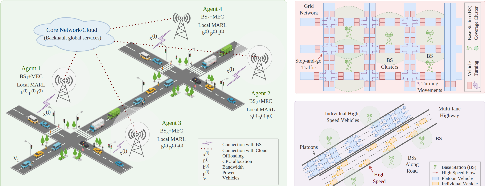
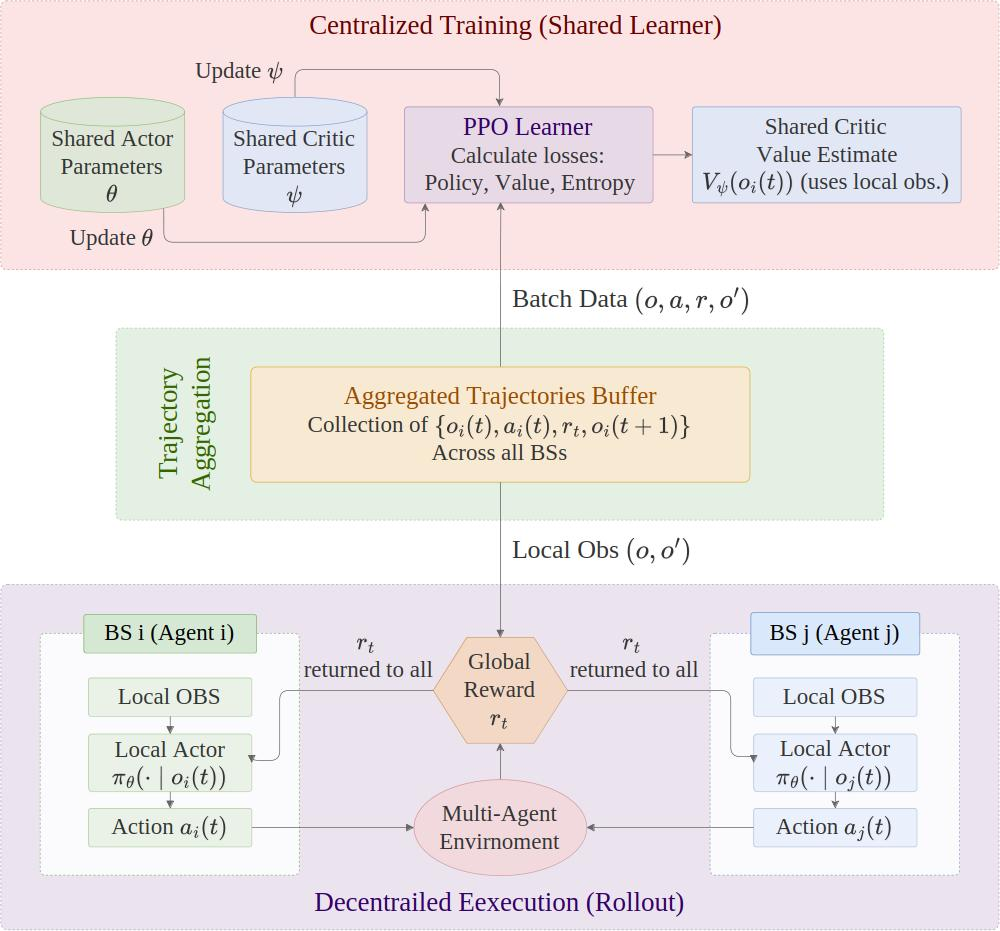
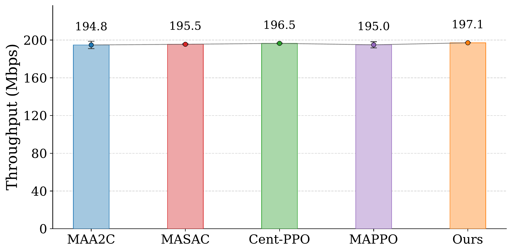
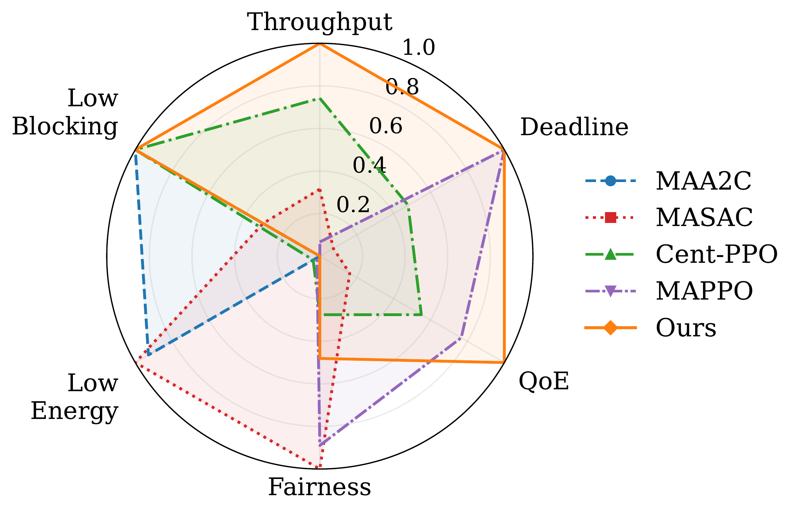
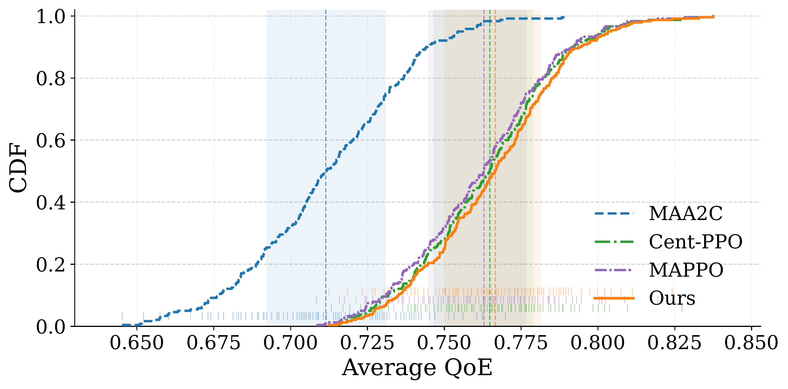
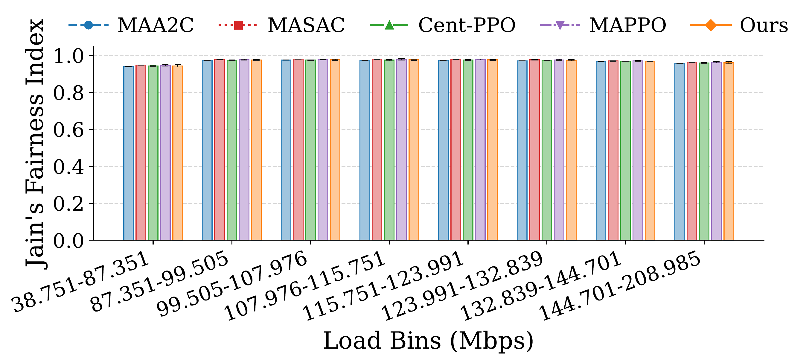

<h1 align="center">Joint Radio-Compute Resource Management for Clustered Vehicular Edge Networks</h1>

<p align="center"><b>Coop-MAPPO-IoV</b></p>

<p align="center">
  
  
  
  
  
  
</p>

> **Arif Raza, Uddin Md. Borhan, Anam Nasir, Jianqiang Li, Jie Chen, and Lu Wang**  
> Shenzhen University, Shenzhen, China  
> Harbin Institute of Technology, Harbin, China  
> Corresponding authors: **Lu Wang** and **Jie Chen**

---

## Overview

<p align="justify">
This repository contains the implementation and evaluation assets for <b>joint high-level radio-compute resource management in clustered vehicular edge networks</b>. The framework studies how clustered base stations (BSs), each paired with a mobile edge computing (MEC) server, can cooperatively control <b>transmit-power budgets</b>, <b>active resource-block budgets</b>, <b>task offloading ratios</b>, and <b>CPU utilization</b> under mobility, reuse-based interference, MEC queue evolution, and heterogeneous intelligent transportation system (ITS) traffic.
</p>

<p align="justify">
The proposed learner is a <b>parameter-shared cooperative Proximal Policy Optimization (PPO)</b> scheme with centralized trajectory aggregation and decentralized execution. Every BS applies the same actor from a compact local observation, and the shared value function uses that same observation rather than a joint network state. The repository includes matched <b>MAPPO</b>, <b>Cent-PPO</b>, <b>MA-A2C</b>, and <b>MA-SAC</b> references, a no-neighbor ablation, BS-density runs, figures, and CSV summaries.
</p>

The framework addresses four tightly coupled challenges in clustered IoV-VEC control:

1. <b>Unified high-level radio-compute orchestration:</b> learned power, active-RB, offloading, and CPU decisions are coupled to deterministic association, scheduling, and power shaping.
2. <b>Cooperative BS-level learning:</b> each BS acts locally, while a common reward and pooled trajectories coordinate shared actor/value updates.
3. <b>Scalable state and reward design:</b> a fixed 20-feature observation and normalized multi-objective reward avoid per-user state growth.
4. <b>Mobility-aware evaluation:</b> the runner supports urban, highway, and mixed regimes; the paper's completed matched cross-seed results are for the default urban setting.

---

## Clustered IoV-VEC System Model

<p align="center">
  
</p>

<p align="justify">
The system model couples BS-MEC clusters, aggregate queues, dynamic association, shared-spectrum interference, and delay-aware offloading. Each BS-MEC agent sets high-level resource budgets; association, one-RB-per-user assignment, and single-pass power shaping remain environment-side operations. The figure's conceptual cloud connectivity does not imply modeled backhaul capacity or delay.
</p>

---

## CTDE Learning Workflow

<p align="center">
  
</p>

<p align="justify">
During rollout, each BS observes its own 20-dimensional vector and samples a four-dimensional continuous action from the shared actor. The simulator updates association, active RBs, interference, offloaded work, MEC service, end-to-end delay, and QoE, then returns one <b>common cluster reward</b> to every BS. During training, all BS trajectories are pooled for shared PPO updates. Both actor and value function are conditioned on local observations; centralized-critic MAPPO is implemented separately as a reference. Online execution is decentralized and needs no joint observation or joint action controller.
</p>

---

## Architecture

```text
Built-in mobility simulator (urban / highway / mixed)
        |
        v
Clustered IoV-VEC environment
  Vehicles, BS coverage, MEC queues, task classes
  Reuse interference, RB assignment, offloading, CPU service
        |
        v
Local BS observation o_i(t)   [20 normalized features]
  - local radio utilization and link/load summaries
  - local MEC backlog, CPU, and offloading state
  - served, blocked, demand, and mobility summaries
  - compact neighbor transmit activity
  - mandatory-offload summary
        |
        v
Shared cooperative actor  pi_theta(a_i | o_i)
  Continuous 4-D action per BS:
    [power fraction, active-RB fraction,
     offloading fraction, CPU utilization fraction]
        |
        v
Environment transition
  Association and one-RB-per-user assignment
  Interference and single-pass power shaping
  Rate, queue, latency, QoE, energy, fairness
        |
        v
Common cluster reward r_t
  + throughput, delay satisfaction, deadline satisfaction, QoE
  - infrastructure energy, blocking, unfairness
        |
        v
Central trajectory aggregation and shared PPO updates
  Local-observation actor + local-observation value function
  PPO clipping + value loss + entropy regularization
```

---

## Method Details

This section summarizes the implemented framework and follows the scope and terminology of the current paper.

### 1. Cooperative MDP and BS Action Space

The clustered vehicular edge network is treated as a cooperative, partially observed control problem with one agent per BS. At control epoch <i>t</i>, BS <i>i</i> selects:

```text
a_i(t) = [alpha_i(t), kappa_i(t), xi_i(t), phi_i(t)] in [0,1]^4
```

with the following meanings:

```text
alpha_i(t)  -> transmit-power budget fraction
kappa_i(t)  -> active-RB budget fraction
xi_i(t)     -> task offloading ratio
phi_i(t)    -> MEC CPU utilization fraction
```

The normalized controls are mapped to physical budgets as:

```text
P_i(t) = alpha_i(t) * P_i^max
K_i(t) = floor(kappa_i(t) * K_i^max + 0.5)
F_i(t) = phi_i(t) * F_i^max
```

This four-variable BS interface deliberately keeps the learned action small. It does not claim end-to-end learned PHY scheduling: user association, RB assignment, and per-RB power refinement are deterministic simulator operations.

---

### 2. Joint Radio-Compute and QoE Modeling

The environment couples radio service, MEC queue evolution, and user QoE in one control loop.

**Radio layer.** The link model uses mobility-dependent, LOS-probability-weighted 3GPP-like UMa path loss, protocol overhead, an SNR gap, capped spectral efficiency, and a rank-1-to-4 MIMO abstraction. It omits stochastic shadowing, fast fading, and explicit Doppler. Each BS uses single-pass local water-filling-style power shaping.

**Association and RB assignment.** Vehicles are reassociated each epoch using estimated rate balanced by BS load. The default assigns one RB per served user; unserved users contribute to blocking.

**Compute layer.** The offloading action determines the admitted MEC work, and aggregate backlog evolves in cycle units:

```text
q_i(t+1) = max{q_i(t) - F_i(t) * Delta, 0} + lambda_i(t)
```

The service-before-arrival model equal-shares newly offloaded work. Eligible light tasks may execute locally; heavy tasks exceeding the UE budget must be offloaded.

**End-to-end delay and QoE.** Total latency combines the radio scheduling-delay proxy with MEC or eligible local-compute delay:

```text
T_u(t) = T_u^r(t) + T_u^m(t)
```

QoE equally weights throughput fulfillment and delay satisfaction. Handover interruption, task migration, backhaul congestion, retransmissions, priority scheduling, and UE energy are not modeled.

---

### 3. Parameter-Shared Cooperative PPO

The proposed method uses one stochastic actor and one value function shared across all BSs. Both consume the same local observation:

```text
a_i(t) ~ pi_theta(. | o_i(t))
V_i(t)  = V_psi(o_i(t))
```

Training pools complete BS trajectories into a shared rollout buffer and applies standard PPO with:

```text
- clipped policy objective
- generalized advantage estimation
- value regression loss
- entropy regularization
- rollout minibatch updates
```

The common reward and pooled experience support cooperation while online decisions stay decentralized. The proposed value function is local; the `mappo` reference uses a local actor with a joint-observation critic, and `cent_ppo` centralizes state and action.

---

### 4. Scalable Observation and Reward Design

Each BS receives a compact 20-dimensional vector whose size does not grow with the vehicle count. The implemented features cover:

```text
- BS type; transmit-power, coverage, and channel utilization
- local load, nearby-user potential, and demand summaries
- average speed, radial motion, and speed variation
- requested-power and interference summaries
- compact neighboring transmit activity
- MEC queue, CPU utilization, and offloading state
- served ratio, blocked fraction, channel match
- mandatory-offload fraction
```

The common reward combines normalized throughput, delay violation, deadline satisfaction, QoE, infrastructure energy, blocking, and BS-level Jain fairness:

```text
reward = 0.30 * throughput
       + 0.20 * delay satisfaction
       + 0.20 * deadline satisfaction
       + 0.30 * average QoE
       - 0.05 * infrastructure energy
       - 0.20 * blocking
       - 0.10 * unfairness
```

The reward is clipped to `[-1, 1]`. These weights are fixed for the reported comparisons; reward-weight sensitivity was not completed and is not claimed as an ablation.

---

### 5. Mobility-Aware Evaluation Protocol

The runner implements three mobility modes:

```text
urban   : grid roads, turns, intersections, and stop-and-go motion
highway : higher-speed lanes, transient coverage, and platoon-like flow
mixed   : per-user combination of urban and highway motion
```

The simulator also models safety-oriented and infotainment sessions, heavy and light task profiles, and stochastic demand refreshes. It records:

```text
- throughput and mean episode return
- average and P95 latency
- 100-ms deadline-satisfaction percentage
- average QoE
- BS-level Jain fairness and blocking
- BS + MEC infrastructure energy
- wall-clock time per environment step
```

The code supports all modes, but the completed three-seed claims below cover only the default urban configuration.

---

## Simulation Setup

The validation platform combines mobility, radio allocation, MEC queue evolution, heterogeneous task arrivals, and policy learning in one discrete-time simulator.

```text
Decision interval             : 1 s
Episode length                : 200 control epochs
Default deployment            : 4 macro BSs, 80 vehicles, 2 km x 2 km
BS height                     : 30 m
Maximum RBs per carrier       : 50
RB bandwidth                  : 180 kHz
Maximum BS transmit power     : 40 W
Carrier set                   : {3.4, 3.5, 3.6, 3.7} GHz
Thermal-noise density         : -174 dBm/Hz
Receiver noise figure         : 7 dB
SNR-gap parameter             : 1.5 dB
Maximum spectral efficiency   : 7.5 bit/s/Hz
MIMO abstraction              : rank up to 4 for macro BSs
MEC capacity per BS           : 50 x 10^9 cycles/s
Workload intensity            : 5 x 10^7 cycles/Mbit
CPU energy coefficient        : 10^-27
Latency target                : 100 ms
Traffic mix                   : 30% safety, 70% infotainment
Demand refresh probability    : 0.05 per user per epoch
```

Heavy tasks occur with probability 0.70, use `0.5-2.5 x 10^9` cycles and `2-8 Mbit`, and must be offloaded when they exceed the `0.5 x 10^9` cycles/step UE budget. Light tasks use `0.05-0.4 x 10^9` cycles and `0.2-1.5 Mbit` and may run locally or be offloaded. The BS-density scalability runs use 100 vehicles and 2, 4, or 8 BSs.

---

## Repository Layout

```text
Coop-MAPPO-IoV-main/
├── CITATION.cff
├── Figs
│   ├── architecture.png            <- clustered IoV-VEC framework
│   └── clde.jpg                    <- shared-PPO training/execution workflow
├── graphs
│   ├── fairness_vs_load.png        <- fairness across offered-load bins
│   ├── latency.png                 <- latency comparison export
│   ├── latency_mean_tail_single_scale.png
│   │                                <- matched mean and P95 latency
│   ├── qoe_cdf.png                 <- per-user average-QoE CDF
│   ├── radar_summary.png           <- normalized matched comparison
│   └── throughput_bar.png          <- cross-seed throughput comparison
├── LICENSE
├── pyproject.toml
├── README.md
├── requirements.txt
├── results
│   ├── ours_seed42.zip             <- proposed method, seeds 42-44
│   ├── ours_seed43.zip
│   ├── ours_seed44.zip
│   ├── primary_mappo.zip           <- centralized-critic MAPPO summaries
│   ├── primary_centppo.zip         <- centralized PPO summaries
│   ├── primary_a2c.zip             <- MA-A2C summaries
│   ├── primary_sac_final.zip       <- final MA-SAC summaries
│   ├── ablation_no_neighbor_seed*.zip
│   │                                <- controlled observation ablation
│   └── ours_bs{2,4,8}_seed*.zip    <- 100-vehicle BS-density runs
└── script
    ├── mappo.py                    <- PPO/MAPPO/ablation/mobility runner
    ├── mappo2.py                   <- primary PPO comparison/aggregation runner
    └── mappo3.py                   <- matched MA-A2C and MA-SAC runner
```

---

## Code Tour

The repository is script-centered. Its runners contain the environment, training, evaluation, and CSV aggregation pipeline; `results/*.zip` stores completed paper runs.

### 1. `script/mappo.py` - targeted PPO-family runner

`mappo.py` is the base end-to-end runner for the proposed method and PPO-family validation. Its `targeted` suite creates the following experiment specifications for every requested seed:

```text
ours / urban / full observation
mappo / urban / centralized critic
cent_ppo / urban / centralized observation and action
ours / urban / neighbor summary masked
ours / highway / full observation
ours / mixed / full observation
```

The `single` suite runs one method and scenario. Outputs include raw CSVs, checkpoints, per-user samples, run summaries, comparison tables, ablation tables, and mobility summaries.

### 2. PHY helpers and link abstractions

At the beginning of every runner, the radio helpers define thermal-noise-based receive sensitivity, SINR-to-spectral-efficiency mapping with a 1.5 dB gap and 7.5 bit/s/Hz cap, and the simplified rank-selection MIMO abstraction.

The control path is:

```text
power and active-RB fractions
   -> BS power/RB budgets
   -> deterministic association and RB assignment
   -> single-pass per-RB power shaping
   -> SINR and spectral efficiency
   -> served throughput
```

This separation makes the learner a high-level cross-layer controller rather than an end-to-end radio scheduler.

### 3. Environment entities: `Channel`, `BaseStation`, and `User`

The three core data classes represent the simulated network:

- `Channel` stores carrier frequency, RB bandwidth, noise figure, noise power, and occupancy.
- `BaseStation` implements UMa LOS/NLOS path loss, coverage, channel assignment, transmit-power state, and MEC state.
- `User` stores mobility, service class, demand, task size, mandatory-offload state, channel assignment, rate, and latency.

### 4. `MultiAgentMobileNetwork` - the main simulator

`MultiAgentMobileNetwork` is an RLlib-compatible `MultiAgentEnv` and contains the executable version of the paper's control model. It handles:

```text
- configurable BS topology and carrier subsets
- urban, highway, and mixed mobility initialization/updates
- per-epoch reassociation and on-demand RB assignment
- inter-BS interference and BS-local power shaping
- heterogeneous task generation and local/offloaded execution
- aggregate MEC queue service and arrival updates
- 20-D local observations and optional neighbor masking
- common multi-objective reward and KPI logging
```

`get_observation()` constructs the 20 local features. When the MAPPO reference is selected, the runner appends the joint BS observation for the custom critic while keeping the actor input local.

### 5. Logging and matched evaluation

`EpisodeCSVLogger` collects per-step scalars during training. `evaluate_algorithm()` then evaluates deterministic policy actions and writes:

```text
train_iterations.csv
eval_steps.csv
eval_bs_steps.csv
eval_episodes.csv
eval_user_steps.csv
eval_user_metrics.csv
run_summary.csv
```

Evaluation seeds start at `900000`. The paper's final tables and graphs align every method and training seed to evaluation seeds `900000-900019`, a common 20-episode window. The aggregation helpers report the mean and sample standard deviation across independent training seeds 42, 43, and 44.

### 6. PPO-family integration

The proposed method uses a shared RLlib PPO policy with separate local actor and value networks. The MAPPO reference uses `SplitActorCentralCriticModel`: its actor consumes the 20-D local vector and its critic consumes the 80-D joint observation when there are four BSs. `CentralizedPPOEnv` flattens the four local observations into 80 dimensions and the four actions into a 16-D joint action.

The common PPO configuration is:

```text
gamma = 0.99
GAE lambda = 0.95
learning rate = 5e-5
clip parameter = 0.2
train batch size = 1024
minibatch size = 256
SGD passes per update = 10
hidden layers = [256, 256], tanh
batch mode = complete episodes
```

These architectures support an information-structure comparison: local actor/local value for Ours, local actor/joint critic for MAPPO, and fully centralized observation/action for Cent-PPO.

### 7. `mappo2.py` and `mappo3.py` - focused comparison runners

`mappo2.py` supports `primary`, `targeted`, `single`, and Ray-free `aggregate` modes. Its primary suite trains MAPPO and Cent-PPO, accepts existing Ours summaries, validates seeds and budget, and rebuilds comparison tables.

`mappo3.py` adds matched MA-A2C and MA-SAC. A2C is local because current Ray removed the older contributed implementation; SAC uses RLlib with shared-policy uniform replay. Both retain the same environment, observation, action, reward, and evaluation protocol.

---

## Requirements

The repository declares its runtime dependencies in both `requirements.txt` and `pyproject.toml`:

- Python 3.10 or newer
- NumPy 1.24 or newer
- Gymnasium 0.28 or newer
- Matplotlib 3.7 or newer
- Ray RLlib 2.8 or newer
- PyTorch 2.0 or newer

A standard setup is:

```bash
git clone https://github.com/arifrazakh/coop-mappo-iov.git
cd coop-mappo-iov

python -m venv .venv
source .venv/bin/activate   # Windows: .venv\Scripts\activate

python -m pip install --upgrade pip
python -m pip install -r requirements.txt
```

The project metadata also supports:

```bash
python -m pip install -e .
```

---

## Quick Start

### 1. Inspect runner options

```bash
python script/mappo.py --help
python script/mappo2.py --help
python script/mappo3.py --help
```

### 2. Run one proposed-method experiment

```bash
python script/mappo.py \
  --suite single \
  --method ours \
  --scenario urban \
  --seeds 42 \
  --eval-episodes 20 \
  --output-dir outputs/ours_seed42
```

The 500,000-step request can finish at the next complete-episode batch boundary; archived PPO-family runs record 500,400 steps.

### 3. Run comparison baselines

For one PPO-family reference:

```bash
python script/mappo2.py --suite single --method mappo \
  --seeds 42 --eval-episodes 20 --output-dir outputs/mappo_seed42
```

For the matched actor-critic baselines:

```bash
python script/mappo3.py --suite baselines \
  --baseline-methods ma_a2c ma_sac \
  --seeds 42 43 44 --eval-episodes 20 \
  --output-dir outputs/a2c_sac
```

### 4. Run a BS-density case

The paper's scalability table uses 100 vehicles. For example, the two-BS case can be launched with:

```bash
python script/mappo.py \
  --suite single --method ours --scenario urban \
  --num-bs 2 --num-users 100 --seeds 44 \
  --eval-episodes 20 --output-dir outputs/ours_bs2_seed44
```

Repeat with `--num-bs 4` and `--num-bs 8`. These are separately trained policies, not a zero-shot transfer test.

### 5. Inspect generated outputs

Each output root contains:

```text
runs/<method>__<variant>__<scenario>__seed<seed>/
  -> configuration, training log, checkpoint, and raw evaluation CSVs

summaries/
  -> merged run summaries and paper-table CSVs
```

The checked-in `results/` directory contains compressed completed summaries and selected raw traces; `graphs/` contains the matched publication figures; `Figs/` contains the system and learning diagrams.

---

## Key Scripts

| Script | Purpose |
|---|---|
| `script/mappo.py` | Proposed PPO, centralized-critic MAPPO, Cent-PPO, neighbor ablation, and mobility suites |
| `script/mappo2.py` | Primary PPO comparison, existing-result validation, merging, and aggregation-only tables |
| `script/mappo3.py` | Matched MA-A2C and MA-SAC training plus full learning-method tables |

---

## Graphs and Visual Results

<p align="center">
  
  &nbsp;
  
</p>

<p align="justify">
<b>Left: Cross-seed average throughput.</b> The proposed method has the highest matched mean throughput at 197.10 Mbps, but all five learning baselines lie in a narrow 194.82-197.10 Mbps range.
</p>

<p align="justify">
<b>Right: Mean and P95 latency.</b> Cent-PPO records the lowest mean and tail latency at 462.89 ms and 1017.28 ms. The proposed method records 464.95 ms and 1034.31 ms, remaining close to the other PPO-family operating points rather than dominating every KPI.
</p>

<p align="center">
  
  &nbsp;
  
</p>

<p align="justify">
<b>Left: Normalized radar summary.</b> Ours has the highest throughput and QoE, Cent-PPO has the lowest latency, and MA-SAC has the highest aggregate fairness and lowest modeled infrastructure energy. The figure visualizes a multi-objective trade-off, not universal dominance.
</p>

<p align="justify">
<b>Right: QoE CDF.</b> The curves substantially overlap, consistent with the small cross-seed aggregate-QoE differences. The proposed distribution is modestly right-shifted, while the shaded bands show cross-seed variation.
</p>

<p align="center">
  
</p>

<p align="justify">
<b>Fairness across offered-load bins.</b> All methods remain in a similar high BS-level fairness region across the reported bins. This supports aggregate balance but does not replace a dedicated worst-BS or worst-user fairness audit.
</p>

---

## Key Results

Final matched urban evaluation; values are mean +/- sample standard deviation across independent training seeds 42, 43, and 44:

| Algorithm | Throughput (Mbps) | Mean Lat. (ms) | P95 Lat. (ms) | Deadline (%) | Block (%) | QoE | Fairness | Energy (J/step) |
|---|---:|---:|---:|---:|---:|---:|---:|---:|
| Cent-PPO | 196.51 +/- 0.43 | **462.89 +/- 4.84** | **1017.28 +/- 39.26** | 15.07 +/- 2.29 | **0.0000 +/- 0.0000** | 0.55868 +/- 0.00583 | 0.96747 +/- 0.00200 | 497781 +/- 3482 |
| MAPPO (centralized critic) | 194.97 +/- 3.25 | 463.75 +/- 3.05 | 1026.05 +/- 16.26 | 16.395 +/- 0.019 | 0.0027 +/- 0.0047 | 0.56058 +/- 0.00310 | 0.97129 +/- 0.00336 | 498611 +/- 996 |
| MA-A2C | 194.82 +/- 3.90 | 483.56 +/- 21.14 | 1078.04 +/- 50.80 | 13.86 +/- 2.25 | **0.0000 +/- 0.0000** | 0.55384 +/- 0.00714 | 0.96576 +/- 0.00052 | 461296 +/- 61965 |
| MA-SAC | 195.54 +/- 0.52 | 476.92 +/- 0.17 | 1039.66 +/- 3.88 | 14.04 +/- 0.12 | 0.0019 +/- 0.0032 | 0.55526 +/- 0.00044 | **0.97198 +/- 0.00081** | **458395 +/- 1549** |
| **Ours** | **197.10 +/- 0.18** | 464.95 +/- 3.25 | 1034.31 +/- 18.67 | **16.396 +/- 0.052** | **0.0000 +/- 0.0000** | **0.56264 +/- 0.00042** | 0.96875 +/- 0.00374 | 499259 +/- 1100 |

The low 100-ms satisfaction rates make these relative comparisons, not URLLC-grade guarantees. Three seeds do not support formal significance or equivalence claims.

Controlled neighbor-information ablation under the same 20-episode window:

| Variant | Throughput (Mbps) | Mean Lat. (ms) | Deadline (%) | QoE |
|---|---:|---:|---:|---:|
| Ours without neighbor summary | 196.94 +/- 0.54 | **464.11 +/- 1.82** | **16.403 +/- 0.032** | 0.56254 +/- 0.00070 |
| **Ours, full observation** | **197.10 +/- 0.18** | 464.95 +/- 3.25 | 16.396 +/- 0.052 | **0.56264 +/- 0.00042** |

Masking the neighbor summary changes throughput by about `-0.08%`; aggregate metrics are nearly unchanged. This feature is not a major or uniformly beneficial source in the reported urban topology.

BS-density scalability with 100 vehicles; these are separate archived runs and the `+/- 0.00` entries do not represent a three-seed scale study:

| BSs | Throughput (Mbps) | Avg. Latency (ms) | P95 Latency (ms) | QoE |
|---|---:|---:|---:|---:|
| 2 | 120.69 +/- 0.00 | 3627.83 +/- 0.00 | 5009.24 +/- 0.00 | 0.285 +/- 0.000 |
| 4 | **197.31 +/- 0.00** | 465.73 +/- 0.00 | 1042.99 +/- 0.00 | 0.563 +/- 0.000 |
| 8 | 197.29 +/- 0.00 | **246.07 +/- 0.00** | **585.91 +/- 0.00** | **0.690 +/- 0.000** |

Densification raises throughput from 2 to 4 BSs and maintains it at 8, while latency and QoE improve. This does not prove zero-shot generalization.

---

## Reference-Based Component View

The final learning comparison separates algorithms by where centralized information or control enters the pipeline.

| Variant | Online execution | Training value input | Role |
|---|---|---|---|
| Ours | Decentralized local actor | 20-D local observation | Proposed parameter-shared cooperative PPO |
| MAPPO | Decentralized local actor | 80-D joint BS observation | Centralized-critic PPO reference |
| Cent-PPO | Centralized 16-D joint action | 80-D joint BS observation | Fully centralized PPO reference |
| MA-A2C | Decentralized shared actor | Local shared value input | On-policy actor-critic baseline |
| MA-SAC | Decentralized shared actor | Local off-policy critics | Off-policy actor-critic baseline |

This view makes the main comparison explicit: the proposed policy reaches a comparable PPO-family operating point without MAPPO's joint-observation critic or Cent-PPO's centralized online controller.

---

## Why the Proposed Method Works

The empirical profile follows from three design choices:

1. <b>Joint high-level radio-compute control</b> exposes power, active RBs, offloading, and CPU utilization to one policy while retaining tractable deterministic scheduling refinements.
2. <b>Common-reward parameter sharing</b> pools experience across BSs and reflects cluster-level interference and queue consequences in every update.
3. <b>Compact local state and a disclosed multi-objective reward</b> keep the input fixed-size and balance throughput, delay, QoE, energy, blocking, and fairness.

The supported conclusion is deliberately narrow: the design attains a competitive urban radio-MEC trade-off with decentralized online decisions. It is not a new PPO optimization rule and is not uniformly best on latency, fairness, or energy.

---

## Reproducibility Notes

- Final learning comparisons use independent training seeds `42`, `43`, and `44`.
- Paper tables and graphs use the matched first 20 evaluation episodes, with evaluation seeds `900000-900019`.
- The proposed PPO, MAPPO, Cent-PPO, and MA-A2C runs reached 500,400 sampled environment steps; final MA-SAC runs used 500,000 steps.
- Every `+/-` value in the main comparison is the sample standard deviation across training seeds, not episode variability from one model.
- The completed numerical comparisons are for the default urban configuration. Highway and mixed modes are implemented but do not have a complete matched three-seed bundle here.
- The archive contains summary-only ZIPs for several runs and full raw traces for selected scalability/SAC cases; paths recorded inside summaries reflect the original training machines.
- Figures in `graphs/` are based on the same matched evaluation data as the main results table.
- Aggregate fairness is reported, but worst-user and worst-BS tail audits are not available.
- The model omits fast fading/Doppler, handover interruption, queued-task migration, backhaul limits, retransmissions, service-priority queues, and UE energy.
- `CITATION.cff` and `LICENSE` are included for citation and reuse information.

---

## License

This project is released under the terms specified in `LICENSE`.

---

## Repository Link

Project page: `https://github.com/arifrazakh/coop-mappo-iov/`
